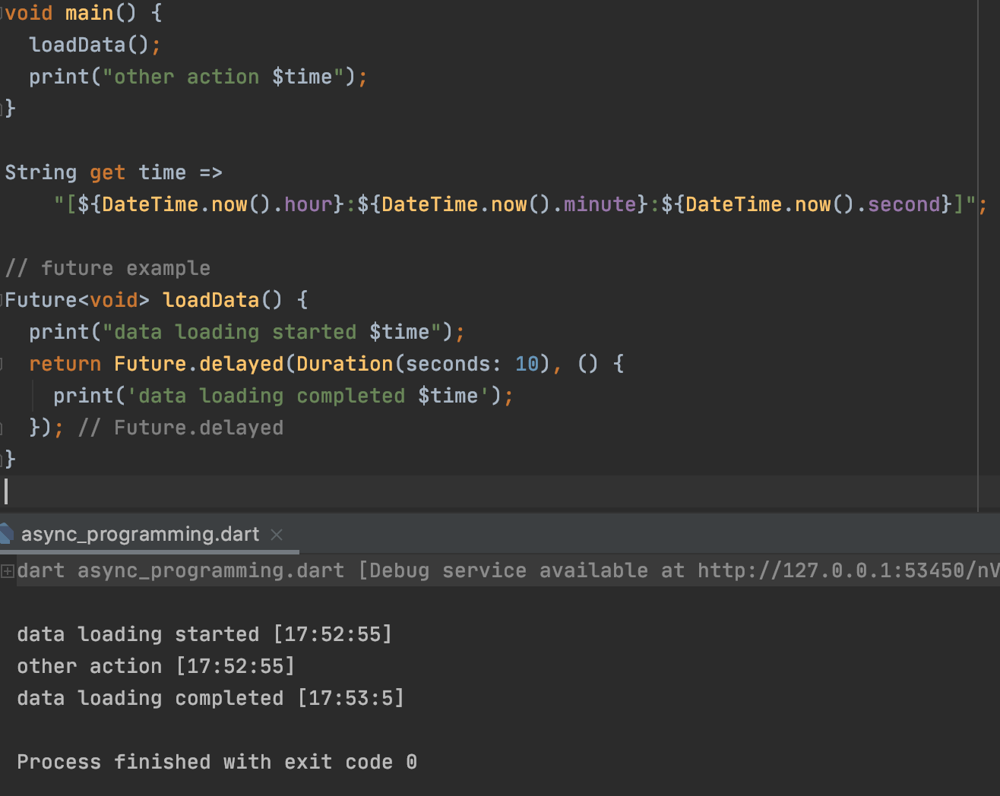
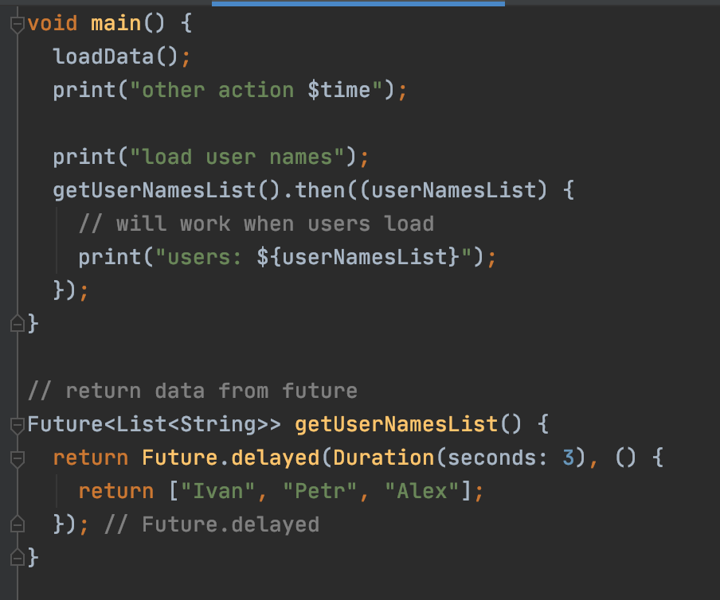
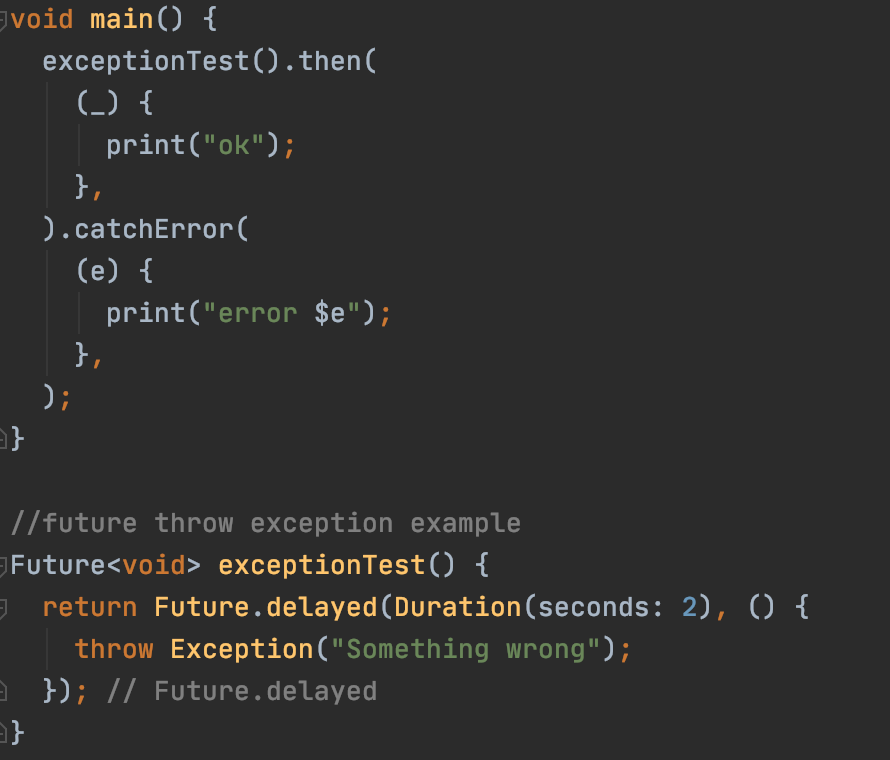
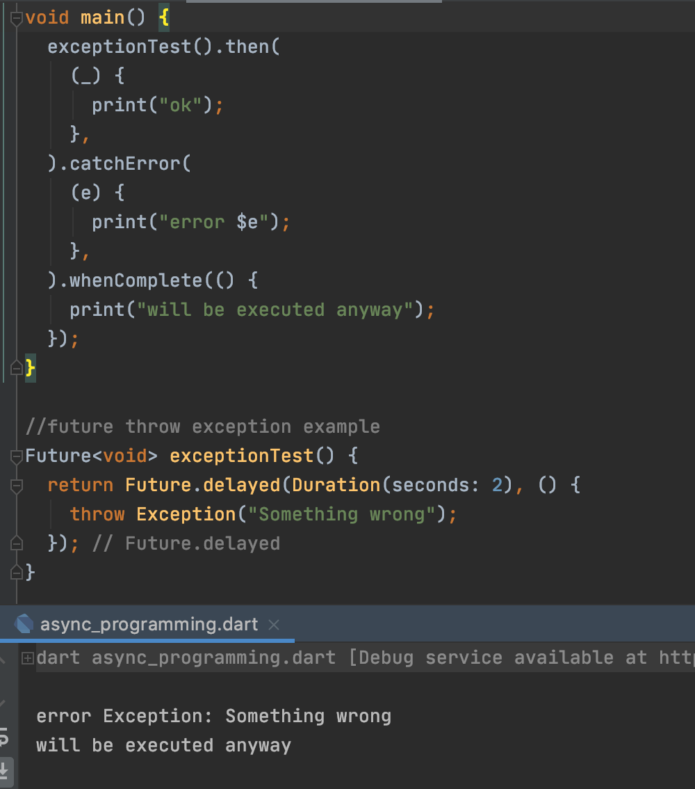
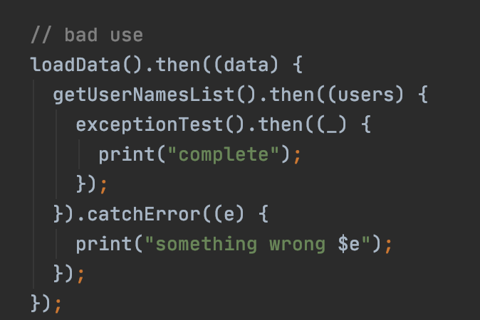
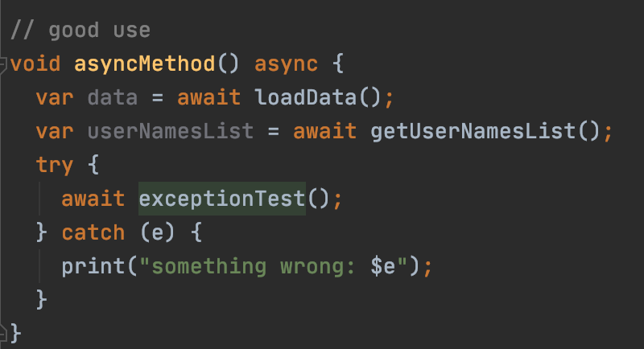

# Асинхронное программирование в Dart

[К оглавлению](../async.md)

## Ключевые ресурсы
> - https://dart.dev/codelabs/async-await (EN) - туториал по async/await и Future

### Future
Тип данных, который возвращает результат в тот момент, когда завершается асинхронная операция. При вызове Future, программа
не дожидается выполнения результата функции.

Результаты выполнения асинхронных операций необходимо обрабатывать. Например, когда произошла загрузка данных - нужно 
показать уведомление для пользователя. Для этого у Future есть колбэки, которые срабатывают в тот момент, когда асинхронная
операция завершает выполнение и возвращает результат.

### then
Позволяет обработать успешный результат асинхронной операции.

### catchError
Ошибку, которая произошла в асинхронной операции можно обработать

### whenComplete
Выполняется когда асинхронная операция завершается. Используется, когда необходимо 
отследить завершение независимо от того, произошла ли ошибка или нет.

### async/await
Иногда необходимо выполнять асинхронные операции последовательно. 
Для этого можно использовать колбэки, но при глубокой вложенности, такой подход делает 
программный код трудным для восприятия.

В качестве альтернативы можно применять async/await. 
Оператор async - используется в сигнатуре метода, помечая, что внутри используются асинхронные операторы.
Оператор await - ожидает выполнение асинхронной операции и переходит на следующую строчку выполнения.

## Пример
[async_programming.dart](future.dart)

## Дополнительные материалы
> - https://medium.com/dartlang/dart-asynchronous-programming-futures-96937f831137 (EN) - подробная статья про Future