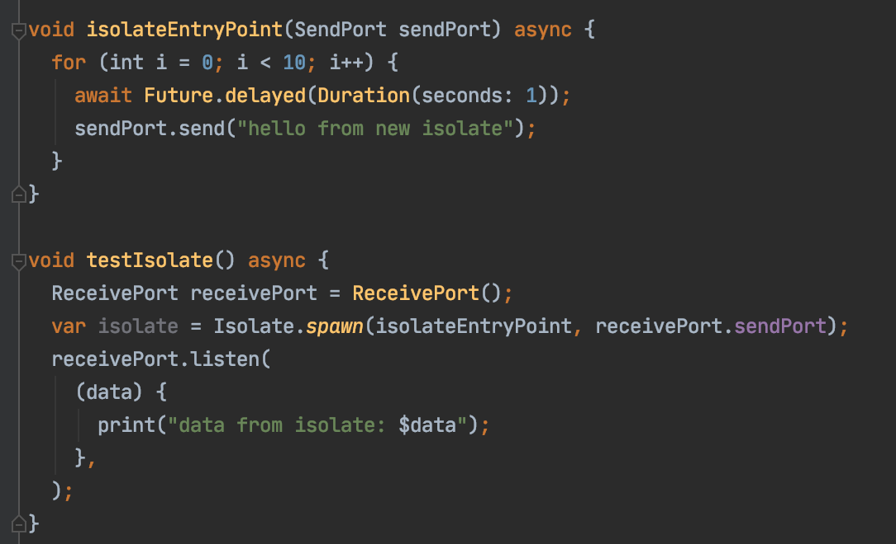

# Изоляты

[К оглавлению](../async.md)

## Ключевые ресурсы
> - https://medium.com/dartlang/dart-asynchronous-programming-isolates-and-event-loops-bffc3e296a6a (EN) - официальный туториал по изолятам
> - https://dart.dev/guides/language/language-tour#isolates (EN) - официальная документация
> - https://api.dart.dev/stable/2.2.0/dart-isolate/Isolate-class.html (EN) - док по изолятам
> - https://api.dart.dev/stable/2.2.0/dart-isolate/ReceivePort-class.html (EN) - док по ReceivePort
> - https://api.dart.dev/stable/2.2.0/dart-isolate/SendPort-class.html (EN) - док по SendPort

## Про изоляты
Для выполнения асинхронных операций некоторые языки программирования(Java, C++) используют многопоточность.
Однако многопоточностью сложно управлять, т.к в один участок памяти могут обращаться несколько потоков одновременно,
что порождает блокировки. Вместо потоков, Dart выполняется внутри изолятов. Каждый изолят имеет свою собственную кучу памяти,
гарантирующую, что ни одно состояние изолята не доступно из любого другого изолята.

Ключевое отличие изолятов от потоков(Stream, Future) заключается в том, что потоки выполняются в главном потоке,
асинхронность достигается при помощи [event loop](https://medium.com/dartlang/dart-asynchronous-programming-isolates-and-event-loops-bffc3e296a6a )- очереди событий. Перед передачей запроса на обработку событие встаёт 
в очередь событий, в которой сначала выполняются события, которые пришли в очередь раньше всех,
и после их выполнения они снимаются с очереди. Тем не менее эти события происходят в главном изоляте, а значит
если в нем будет происходить сложно-выполнимая задача(парсинг большого количества данных, обработка изображений), то
производительность приложение понизится.

Для выполнения подобных операций, применяются изоляты. Создается отдельный изолят,
в нем выполняются сложные вычисления, затем результат выгружается в главный изолят.
Таким образом во время выполнения операции главный изолят остается доступным для обработки 
пользовательских событий, тем самым повышается производительность приложения.

### Использование изолятов
Изолят можно создать при помощи метода `spawn(Function entryPoint, T message)`.
Параметр `entryPoint` необходим для инициализации работы изолята. Он обязательно должен
являться функцией верхнего уровня или статической функцией. Параметр `message` необходим для получения
данных из изолята.

### Обмен данными
Для обмена данными между изолятами используются объекты `SendPort` и `ReceivePort`.

### Завершение изолята
Для завершения работы изолята используется метод `kill({int priority})`
Параметр `priority` необходим для определения приоритета завершения изолята. Имеет два значения:
- immediate - немедленно завершает изолят.
- beforeNextEvent - завершает работу изолята после того, как из него вернулось последнее событие.

## Дополнительные материалы
- https://medium.com/dartlang/dart-asynchronous-programming-isolates-and-event-loops-bffc3e296a6a (EN) - статья по теории потоков и изолятов
- https://codingwithjoe.com/dart-fundamentals-isolates/ (EN) - туториал по изолятам

## Пример
[isolates.dart](isolates.dart)