# Streams

[К оглавлению](../async.md)

## Ключевые ресурсы
Официальные туториалы по потокам (EN)
> - https://dart.dev/tutorials/language/streams
> - https://dart.dev/articles/libraries/creating-streams
> - https://dart.dev/codelabs/async-await
> - https://dart.dev/tutorials/language/streams 

## О потоках
Поток это последовательность асинхронных операций.
Потоки, в отличии от обычных операций выполняются асинхронно, т.е программа не дожидается результата выполнения функции 
и приступает к обработке следующей операции. Для обработки асинхронных функций, необходимо использовать колбэки - 
специальные функции, которые срабатывают в тот момент, когда из потока возвращаются данные, или он завершает свою работу.
Они бывают двух типов:

## Future
Возвращает результат в тот момент, когда завершается асинхронная операция. После выполнения завершает свою работу.

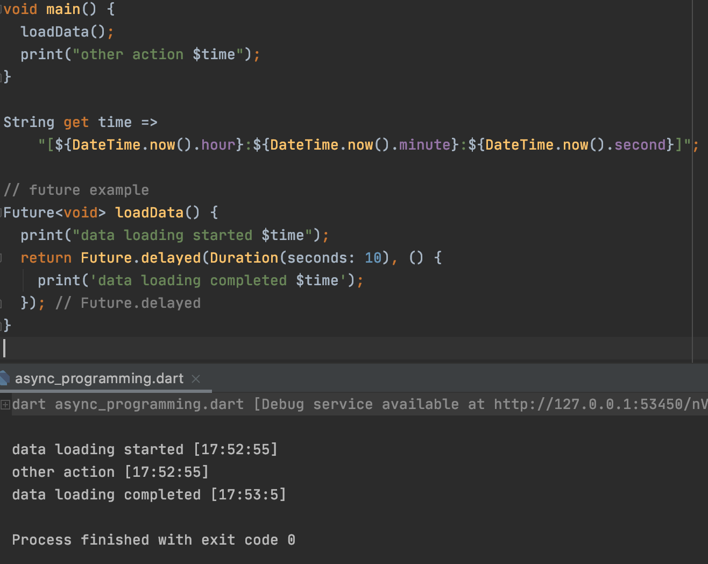

Результаты выполнения асинхронных операций необходимо обрабатывать. Например, когда произошла загрузка данных - нужно 
показать уведомление для пользователя. Для этого у Future есть следующие колбэки:

### then
Обрабатывает успешный результат асинхронной операции.

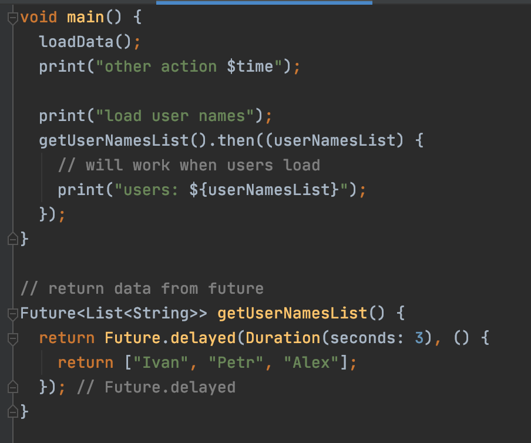

### catchError
Обрабатывает ошибку, произошедшую во время выполнения асинхронной операции

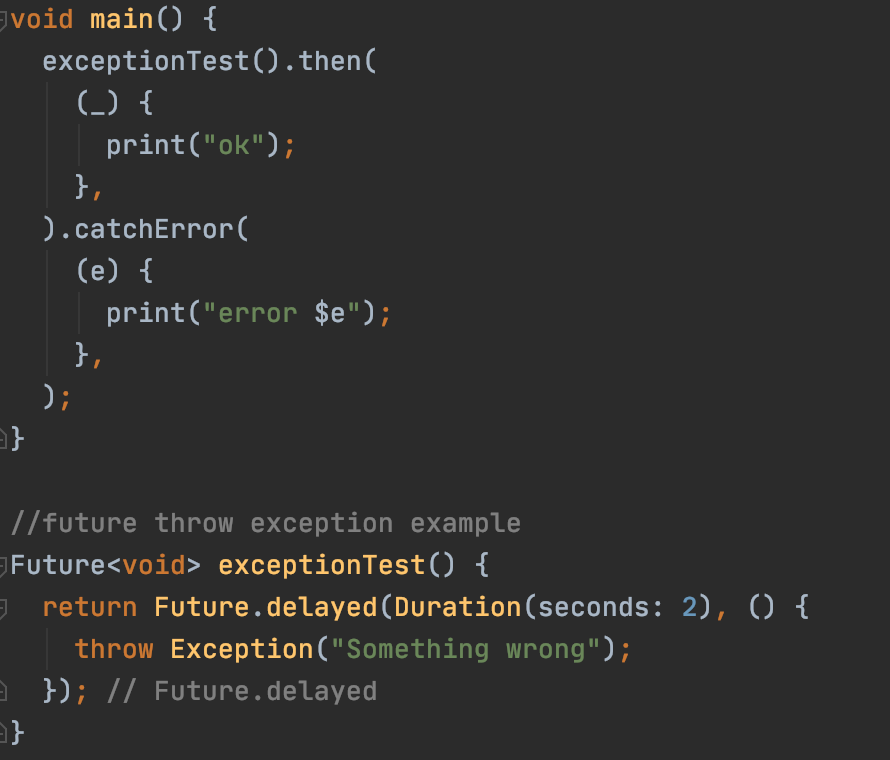

### whenComplete
Выполняется когда асинхронная операция завершается. Используется, когда необходимо 
отследить завершение независимо от того, произошла ли ошибка или нет.

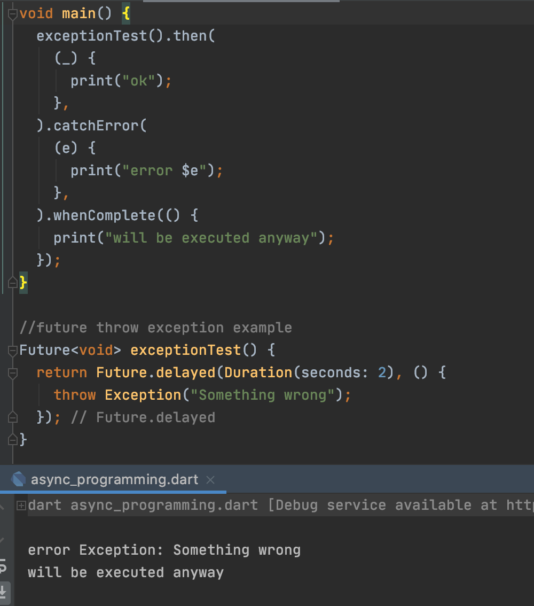

### async/await
Иногда необходимо выполнять асинхронные операции последовательно. 
Для этого можно использовать колбэки, но при глубокой вложенности, такой подход делает 
программный код трудным для восприятия.

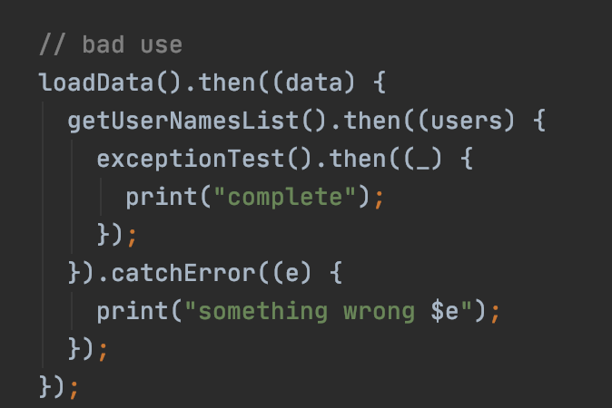

В качестве альтернативы можно применять async/await. 
Оператор async - используется в сигнатуре метода, помечая, что внутри используются асинхронные операторы.
Оператор await - ожидает выполнение асинхронной операции и переходит на следующую строчку выполнения.

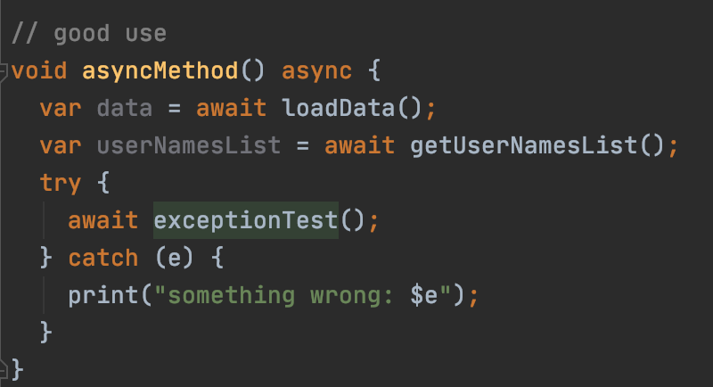

## Stream
Может работать продолжительное время, прослушивая асинхронные операции и последовательно возвращать результат.

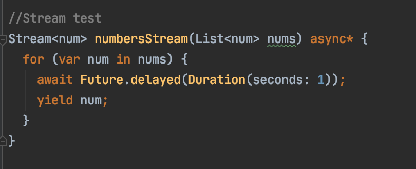

Ключевое слово `yeld` используется, чтобы возвращать данные из потока, не завершая выполнение функции.

### Прослушивание потока
В отличии от Future, ответ от потока может приходить несколько раз. Для продолжительного прослушивания потока используется
метод `listen()`.Он возвращает StreamSubscription. Подписка предоставляет события слушателю и содержит колбэки,
используемые для обработки асинхронных событий.

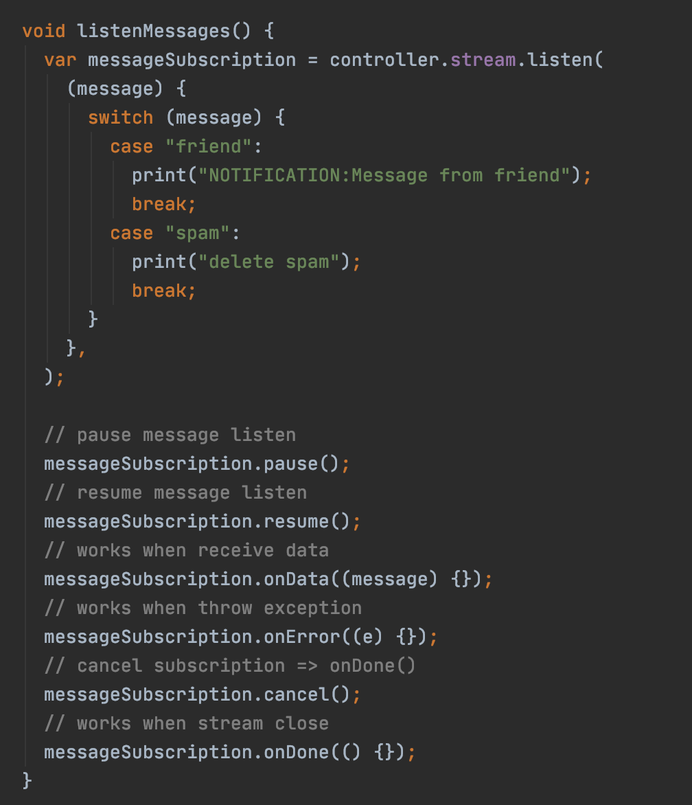

- pause() - приостановка прослушивания потока
- resume() - возобновление прослушивания потока 
- onData(data) - срабатывает, когда в MessageController добавляются данные
- onError(error) - срабатывает во время ошибки в потоке
- cancel() - завершает выполнение прослушивания потока. После завершения прослушивания потока, второй раз подписаться на него нельзя.
- onDone() - выполняется, когда завершается прослушивание потока

### Трансформация данных
Во время прослушивания потока, с поступаемыми данными можно производить различные операции.

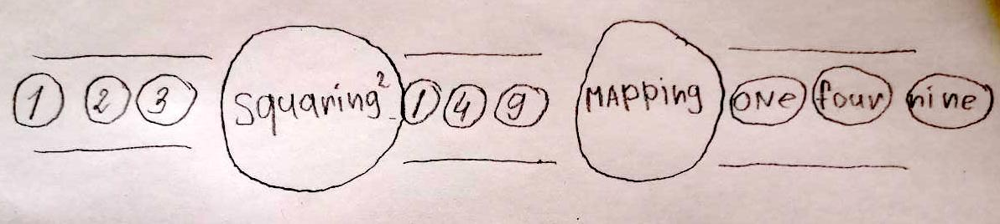

Наиболее часто используемые:
- map() - Маппинг данных. 

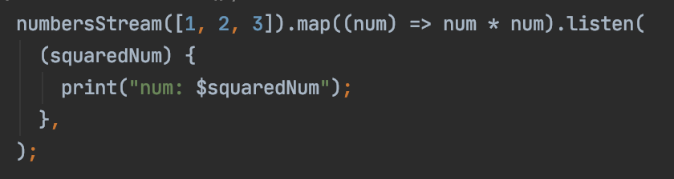

- where() - поиск данных по условию

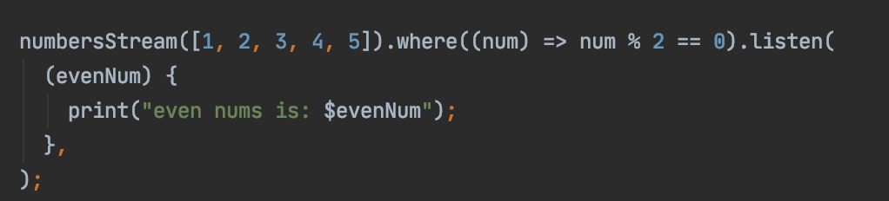

- expand() - расширяет каждый элемент потока на отдельный список элементов

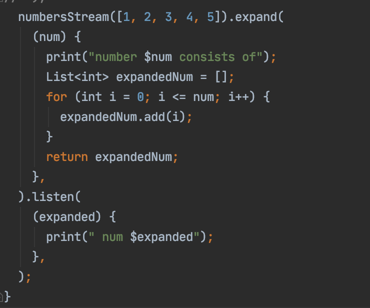

Более подробно ознакомиться со списком операторов трансформации можно в [официальной документации](https://dart.dev/tutorials/language/streams)

## StreamController
Чаще всего для работы с потоками используется `StreamController`. Этот контроллер позволяет отправлять данные,
ошибки и выполненные события в своем потоке. Этот класс можно использовать для создания простого потока `Stream`, 
который могут прослушивать другие, и для отправки событий в этот поток. Можно проверить, приостановлен ли поток или нет,
есть ли у него подписчики, а также получить колбэк при любом из этих изменений.

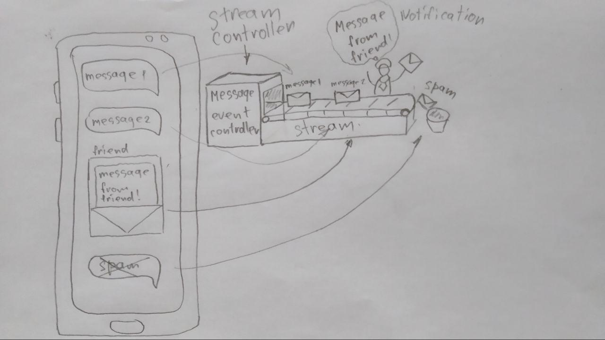

Этот механизм можно сравнить с производственным конвейером, который непрерывно вращается, продвигая по ленте асинхронные события.
Благодаря такому механизму есть возможность обрабатывать асинхронные события в течении продолжительного времени.
Например необходимо прослушивать поток сообщений, а когда придет сообщение от друга, открыть сообщение и вывести его на экран.

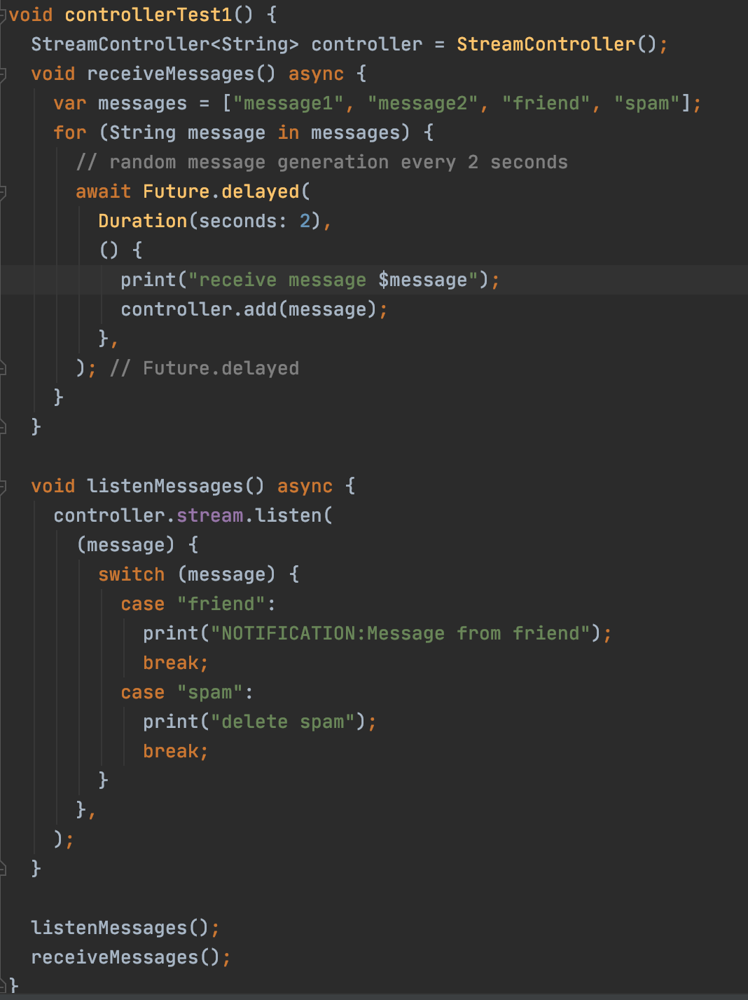

## Пример
[future.dart](future.dart)

[streams.dart](streams.dart)

## Дополнительные материалы
> - https://habr.com/ru/post/450950/ (RU) - в статье наглядно рассказано про потоки с картинками
> - https://medium.com/dartlang/dart-asynchronous-programming-futures-96937f831137 (EN) - подробная статья про Future
> - https://medium.com/dartlang/dart-asynchronous-programming-streams-2569a993324d (EN) - еще одна статья про потоки, StreamBuilder и примером на Flutter
> - https://medium.com/@jelenaaa.lecic/what-are-sync-async-yield-and-yield-in-dart-defe57d06381 (EN) - статья про async/yield