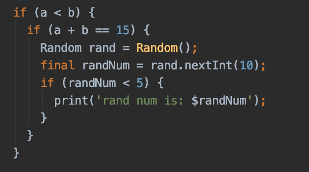

# Условные операторы
[На главную](../dart.MD)

## Ключевые ресурсы
> - https://dart.dev/guides/language/language-tour#if-and-else (EN) - официальная документация по if
> - https://dart.dev/guides/language/language-tour#switch-and-case (EN) - официальная документация по switch

## Об условных операторах
В языке Dart, как и в других остальных, есть условные операторы.
Они необходимы, когда программе требуется обработать определённые
сценарии работы при некоторых условиях. Например "Если у игрока меньше 
10 жизней, предложить выпить зелье здоровья".

### if else
Условный оператор if используется, когда нужно выполнить блок кода
при определённом логическом условии. Если условие верно - выполнить первый сценарий,
иначе выполнить второй сценарий.

### else if
Иногда сценариев может быть больше. Тогда следует применить оператор else if

### Несколько условий в одном
Если для выполнение определенного сценария необходимо проверить сразу несколько
условий, можно их объединить в одну строку, при помощи логических операторов "and, or, xor, not".

### Вложенные условия
Когда необходимо сделать цепочку условий, следующих одно за другим,
можно вкладывать одно условие в другое.

### switch
Условный оператор switch применятся, когда необходимо определить сценарии
работы программы с заранее известным количеством условий. Например, необходимо
по номеру месяца в году, определить сезон. Если ни одно условие не соответсвует
входящим данным, выполняется сценарий default.

## Пример
[conditional_statement.dart](conditional_statement.dart)

## Дополнительные материалы
> - https://www.w3adda.com/dart-tutorial/dart-conditional-operators (EN) - подробная статья по условным операторам