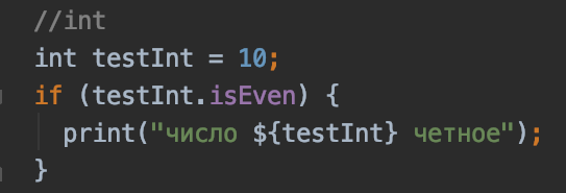
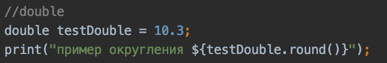
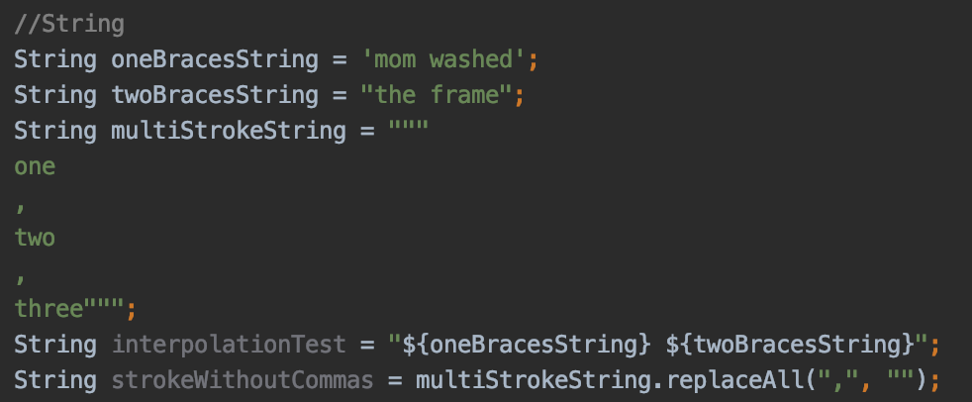
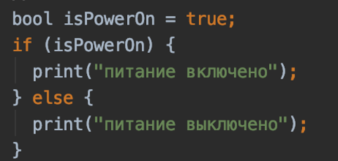
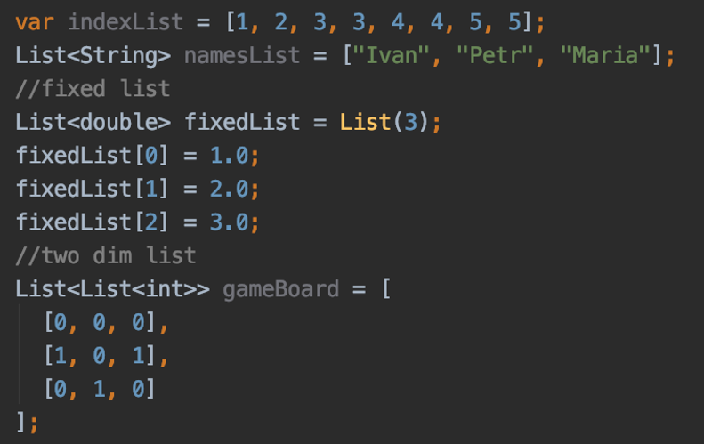
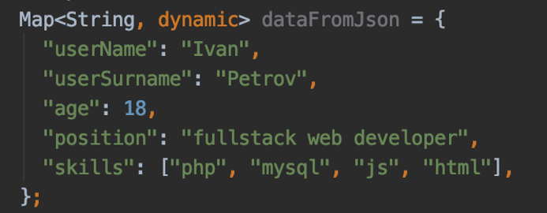
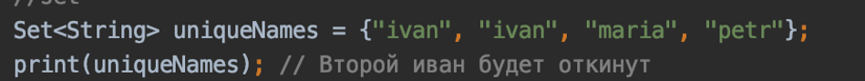
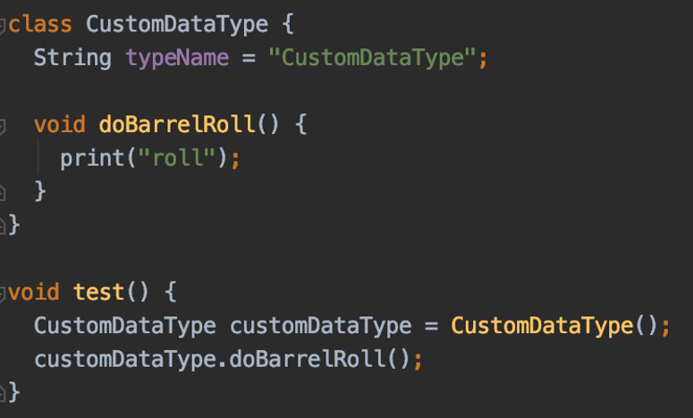
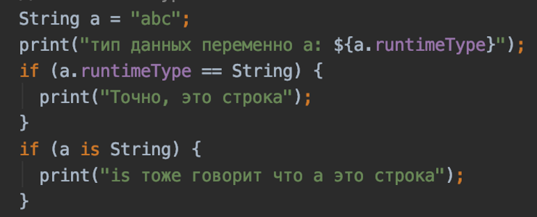

#Типы данных в Dart.
Dart – объектно-ориентированный язык программирования. Все типы данных представляют собой объекты.
В отличии от Java или JavaScript, на Dart даже примитивные типы данных, такие как int, double, 
bool – являются объектами, т.е помимо хранимого значения в памяти, наделены функционалом. 
#Наиболее часто встречающиеся стандартные типы данных:
Number - базовый тип для чисел в Dart. Имеет две реализации – int и double.
Int – целые числа. Кодируются 64 битами. Содержит функционал для работы с целыми числами.

Double – числа с плавающей точкой. Кодируются 64 битами. Содержит функционал для работы с плавающими числами.

String – строки. Можно записывать с одинарными или двойными кавычками – для однострочных строк и тройные ковычки – для
многострочных. Для интерполяции строки используется символ ${}. Содержит функционал для работы со строками.

Boolean – логическое представление true или false. 

List – списочный тип данных. Реализации списка хранят упорядоченный, проиндексированный от 0 до n набор элементов.
Список может быть фиксированного размера и нефиксированного. Содержит функционал для работы со списками. 

Map – карты как в Java или словари как в  Swift. Хранит данные в формате ключ-значение.

Set – неупорядоченное множество уникальных элементов.

Чтобы создать свой тип данных можно использовать различные подходы.
Самый частый пример — это создание класса. После этого можно использовать данный класс для работы в различных
местах программы.

Нередко во время выполнения программы требуется проверить тип данных переменной.
Это можно сделать двумя способами. Проверить runtimeType объекта – его тип данных,
или воспользоваться синтаксическим сахаром – ключевым словом is.
 
##Пример
[variables.dart](data_types.dart)
##Дополнительное чтение
https://medium.com/run-dart/dart-dartlang-introduction-variables-and-data-types-d269ea7d1f8f
https://dart.dev/guides/language/language-tour#built-in-types
https://metanit.com/dart/tutorial/2.3.php

