# Типы данных в Dart
[На главную](../dart.MD)

## Ключевые ресурсы
> - [Dart Language Tour / Built in types](https://dart.dev/guides/language/language-tour#built-in-types) (EN, official) - раздел Dart Language Tour про типы данных
> - [The Dart type system](https://dart.dev/guides/language/sound-dart) (EN, official) - описание системы типов в Dart

## О типах
- Все, что вы можете поместить в переменную, является объектом, а каждый объект является экземпляром класса. 
Даже функции (```Function```) и ```void``` являются объектами. Все объекты наследуются от класса ```Object```.
- Dart поддерживает дженерики.

## Стандартные типы данных
Как и в других языках программирования, в Dart есть базовые типы:

### int
Целые числа. Кодируются 64 битами. Реализует функционал для работы с целыми числами.

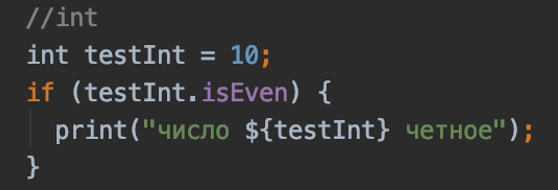

### double
Числа с плавающей точкой. Кодируются 64 битами. Реализует функционал для работы с плавающими числами.

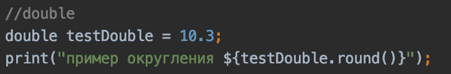

### String
Строки. Оформляются одинарными или двойными кавычками – для однострочных строк, тройными кавычками – для
многострочных. Для интерполяции используется конструкция `${}`. Реализует функционал для работы со строками.

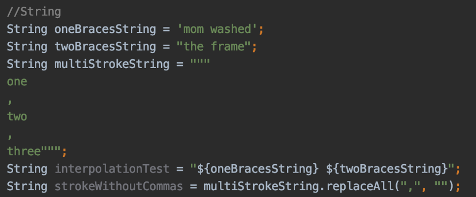

### bool

Логический тип данных.

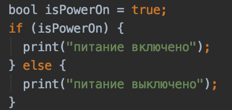

### List
Базовый тип коллекции. Представляет собой упорядоченный, проиндексированный от 0 до n набор элементов.

Лист может быть фиксированного размера и нефиксированного. Реализует функционал для работы с коллекциями.


### Map
Карты (как в Java) или словари (как в Swift). Структура данных дня хранения пар данных в формате "ключ-значение".

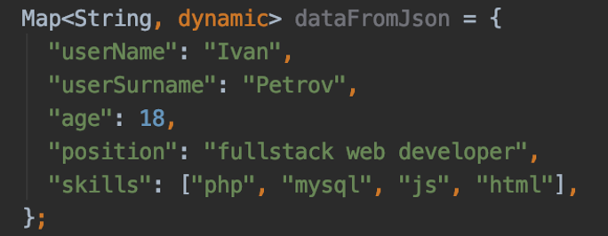

### Set 
Неупорядоченное множество уникальных элементов.

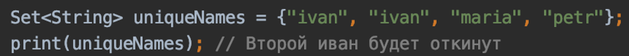

## Кастомные типы данных

Чтобы создать свой тип данных, необходимо написать класс.
После этого можно инициализировать объекты этого типа в коде программы.


## Проверка на соответствие типу

Нередко во время выполнения программы требуется проверить тип данных переменной.

Это можно сделать двумя способами. Проверить runtimeType объекта – его тип данных,
или воспользоваться синтаксическим сахаром – ключевым словом is.

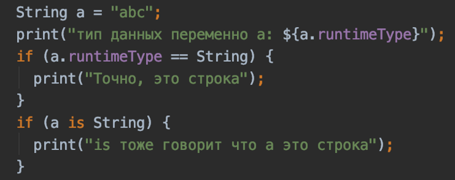 

## Приведение типов

Все типы данных связаны между собой иерархией наследования.

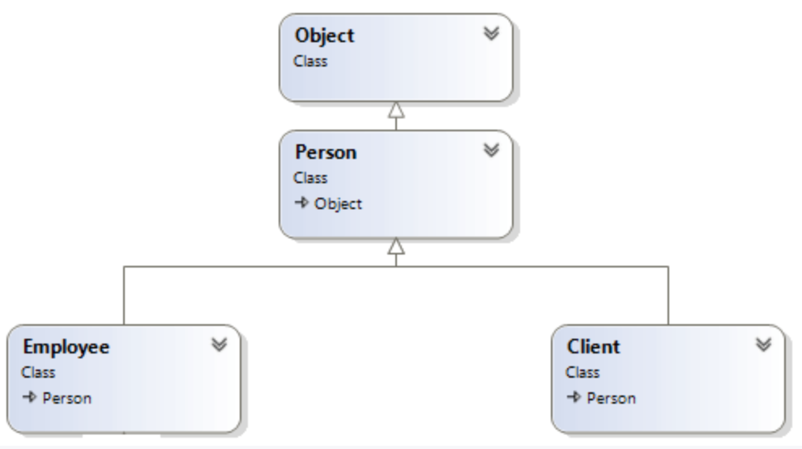 

Благодаря этому есть возможность преобразовывать дочерний типы к родительским и наоборот.

Восходящее преобразование типа происходит автоматически.

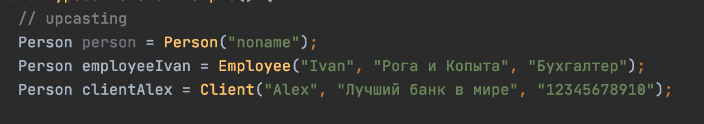 

Для нисходящего преобразования необходимо использовать ключевое слово ```as```, либо задать явный тип данных

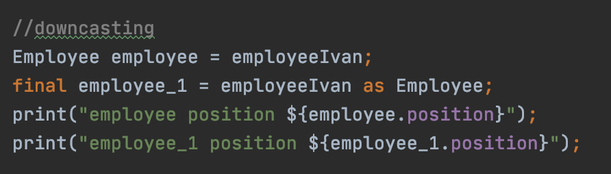

Если попытка приведения одного типа к другому завершилась с ошибкой, это значит, что данные типа не находятся в отношениях наследования друг с другом.

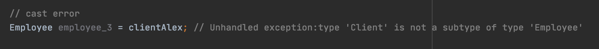

Во избежание таких ошибок следует выполнять проверку на соответствие типу перед преобразованием. 

## Исходники
- [variables.dart](data_types.dart)

## Полезные ссылки
- [Dart (DartLang) Introduction: Variables and Data Types](https://medium.com/run-dart/dart-dartlang-introduction-variables-and-data-types-d269ea7d1f8f) (EN) - подробное описание системы типов Dart.