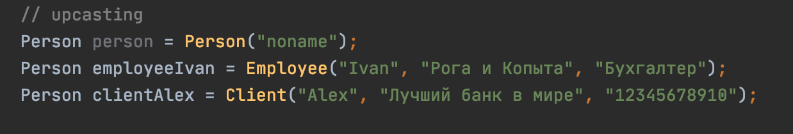

# Типы данных в Dart
[На главную](../dart.MD)

## Ключевые ресурсы
> - https://dart.dev/guides/language/language-tour#built-in-types (EN) - раздел Dart Language Tour про типы данных
> - https://dart.dev/guides/language/sound-dart - про систему типов в Dart
> - https://medium.com/run-dart/dart-dartlang-introduction-variables-and-data-types-d269ea7d1f8f (EN) - подробно описано про типы данных

## О типах
- Все, что вы можете поместить в переменную, является объектом, а каждый объект является экземпляром класса. 
Четные числа, функции и ноль являются объектами. Все объекты наследуются от класса Object.
- Dart поддерживает дженерики

## Стандартные типы данных
Как и в других языках программирования, в Dart есть базовые типы:

### int
Целые числа. Кодируются 64 битами. Реализует функционал для работы с целыми числами.

### double
Числа с плавающей точкой. Кодируются 64 битами. Реализует функционал для работы с плавающими числами.

### String
Строки. Оформляются одинарными или двойными кавычками – для однострочных строк, тройными кавычками – для
многострочных. Для интерполяции используется конструкция `${}`. Реализует функционал для работы со строками.

### bool

Логический тип данных.

### List
Базовый тип коллекции. Представляет собой упорядоченный, проиндексированный от 0 до n набор элементов.

Лист может быть фиксированного размера и нефиксированного. Реализует функционал для работы с коллекциями.

### Map
Карты как в Java или словари как в  Swift. Хранит данные в формате ключ-значение.

### Set 
Неупорядоченное множество уникальных элементов.

## Кастомные типы данных

Чтобы создать свой тип данных, необходимо написать класс.
После этого можно инициализировать объекты этого типа в коде программы.

## Проверка типа данных

Нередко во время выполнения программы требуется проверить тип данных переменной.

Это можно сделать двумя способами. Проверить runtimeType объекта – его тип данных,
или воспользоваться синтаксическим сахаром – ключевым словом is.

 

## Приведение типов

Все типы данных связаны между собой иерархией наследования.

 

Благодаря этому есть возможность преобразовывать дочерний типы к родительским и наоборот.

Восходящее преобразование типа происходит автоматически.

 

Для нисходящего преобразования необходимо использовать ключевое слово as, либо задать явный тип данных

Иногда, во время преобразования типов, может произойти ошибка несоответствии типов,
т.к они не являются звеньями одной цепочки наследования

В таких ситуациях, перед преобразованием типа, необходимо выполнять проверку на тип, которая описана выше. 

## Исходники
- [variables.dart](data_types.dart)