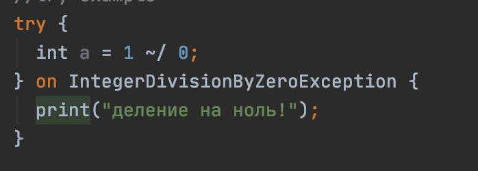
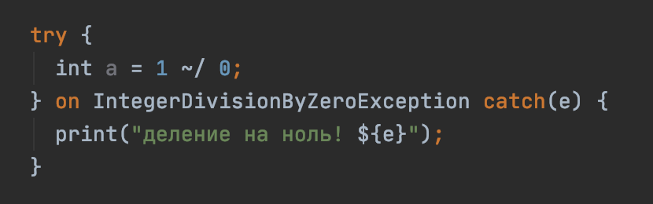
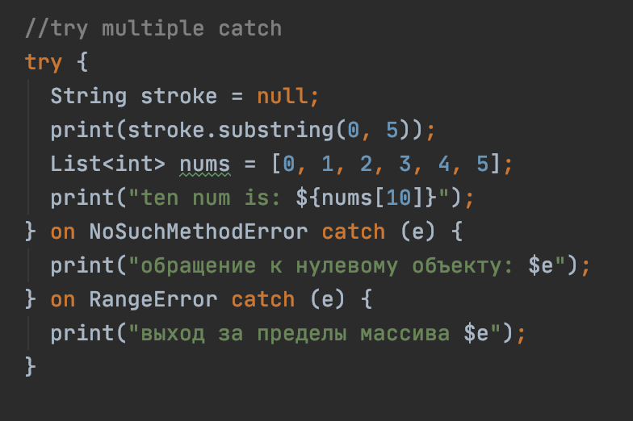
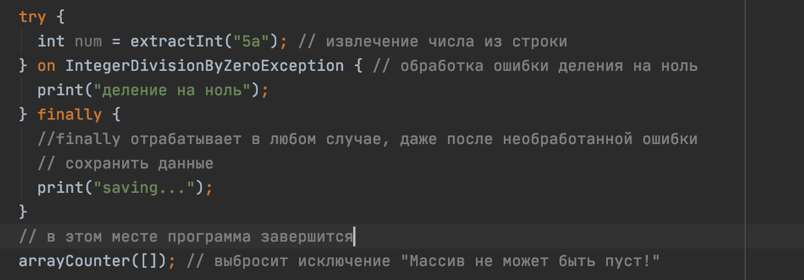
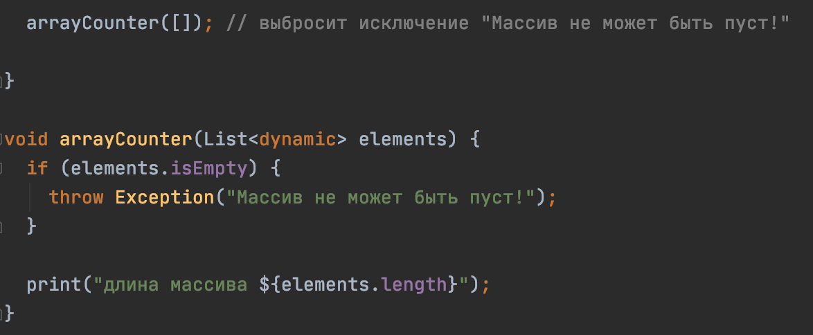
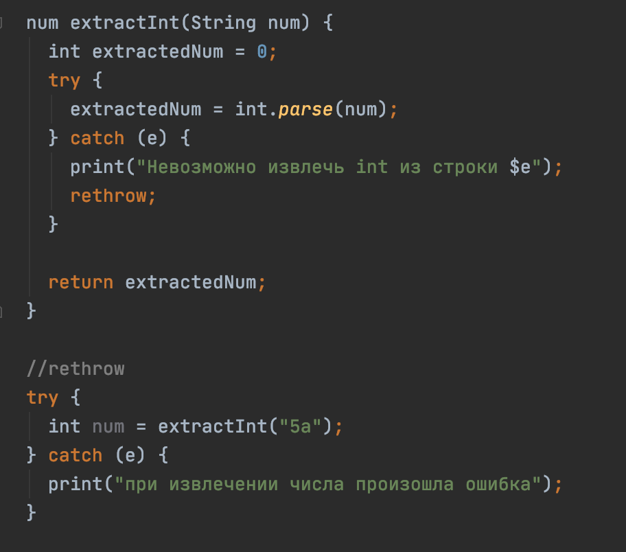
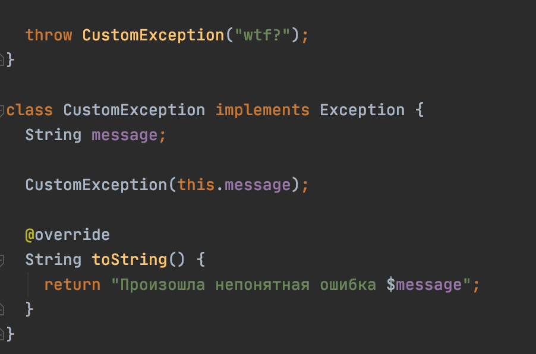
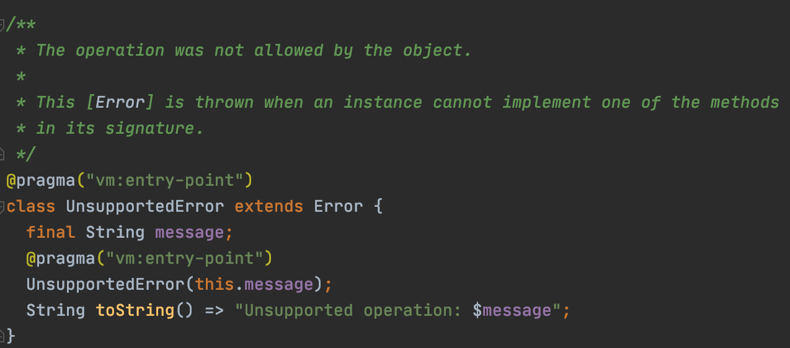

# Исключения и ошибки
В ходе работы программы могут возникать непредвиденные ситуации.
Например деление на ноль, выход за пределы массива, передача неправильных параметров в функцию,
отключение интернета от устройства и тд. Программа должна предвидеть такие ситуации и уметь их
обрабатыват. Для этого в языке Dart существуют обработчики ошибок. 

##Обработчики ошибок

###try catch
Чтобы попытаться отловить ошибку, потенциально опасный код помещают в блок `try`.
Если в нем происходит исключение, программа переходит в блок catch и обрабатывает
ошибку, которая по мнению программиста тут может произойти.

Если в блоке обработки исключения необходимо заполучить объект ошибки, необходимо использовать
ключевое слово `catch`

Иногда необходимо обрабатывать сразу несколько ошибок в одном `try` блоке.

###finally
Иногда в блоке try возникают исключения, которые не отловили в catch. Тогда программа вылетает с ошибкой.
Чтобы при вылете из программы сохранить пользовательские данные, удобно использовать ключевое слово
`finally`. Оно выполняется в любом случае, даже если произошла ошибка.

##Проброс исключений
Помимо обработки исключений, в Dart их можно создавать с помощью ключевого слова `throw`

###rethrow
Когда необходимо пробросить ошибку наверх, но частично обработать в том месте, где она возникла,
можно использовать ключевое слова `rethrow`

## Пользовательские исключения
В языке Dart предустановлено много типов исключений. Но иногда приходится создавать свои типы
исключений для обработки ошибок программы.Они делятся на два вида `Error` и `Exception`.
`Error` - это ошибки кода. Они возникают, когда код используется неправильным образом.
Например при передачи данных в функцию, передается неверный тип данных. `Exception` - 
это ошибки, возникшие во время выполнения программы. 

Пример с `Exception`

Пример с `Error`

##Пример
[exceptions.dart](exceptions.dart)

##Дополнительные материалы
https://dart.dev/guides/language/language-tour#exceptions
https://api.dart.dev/stable/2.7.2/dart-core/Exception-class.html
https://api.dart.dev/stable/2.7.2/dart-core/Error-class.html