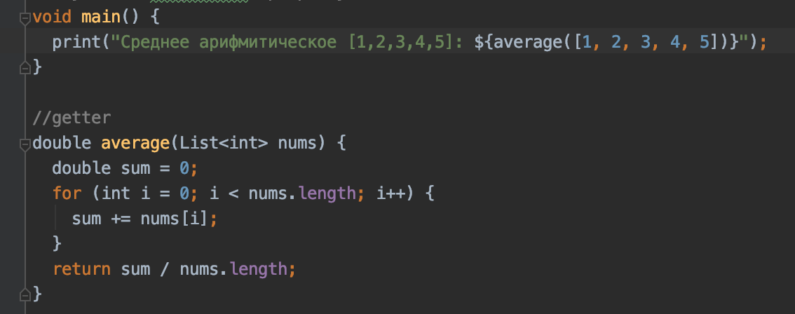
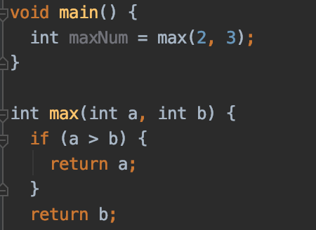
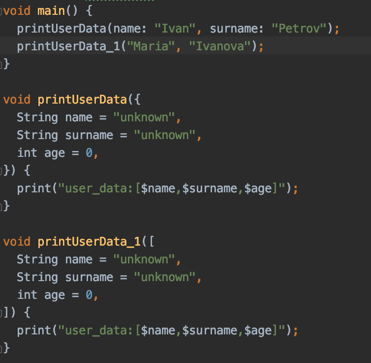
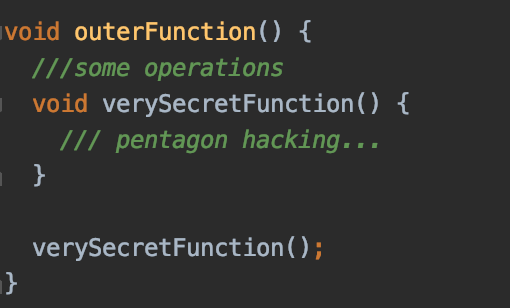

#Функции
Когда программа становится больше 10 строчек когда, полезно использовать функции.
В отличии от более строгих языков программирования, таких как Java или C#,
Dart больше похож на JS или Kotlin. Программа на Dart может состоять из одних функций.
В Dart все является объектами, в том числе функции, а это означает,
что функцию можно сохранить в переменной и передавать из одного места 
приложения в другое точно так же, как String, int или любой другой объект.

##Тип возвращаемого значения
###Getter
Когда после выполнения всех операций, функция должна вернуть некий результат,
необходимо использовать тот тип данных, которая она возвращает. Например,
вычисление среднего арифметического массива.

###Setter
Когда после выполнения всех операций, функция должна просто завершиться,
необходимо перед названием функции использовать тип данных void. Например,
вывод логов в консоль.

##Параметры функции
Иногда, чтобы передать внутрь функции значения для работы, нужно воспользоваться параметрами.

###Обязательные параметры
Если все параметры должны инициализироваться из вне, необходимо использовать обязательные параметры.

###Опциональные параметры
Иногда некоторые параметры удобно ициализировать по умолчанию.
Тогда можно воспользоваться опциональными параметрами. Они бывают двух видов.
С наименованием и без наименования.

##Анонимные функции
Когда в качестве параметра функции необходимо использовать другую функцию, то очень удобно
использовать анонимную функцию. Это та же самая функция, только без названия. Наиболее частый
пример - метод .forEach(void f(T element)). На каждой итерации цикла, внутри метода foreach
вызывается функция из параметров, с переданным элементом во внутрь. Анонимная функция реализуется
при вызове метода.

 
##Вложенные функции
Когда необходимо скрыть одну функцию внутри другой - используйте вложенные функции.
Чтобы вложенная функция заработала, ее вызов должен располагаться после объявления.

##Замыкания
Замыкание - это функция, содержащая в себе ссылки на переменные из внешней области видимости.
Т.е. она "замыкает" внешние переменные в себе. Существует два вида замыканий.

##
todo доделать замыкания