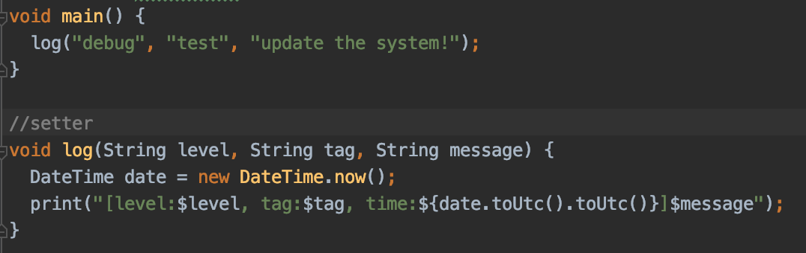
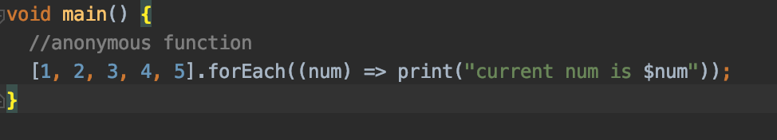
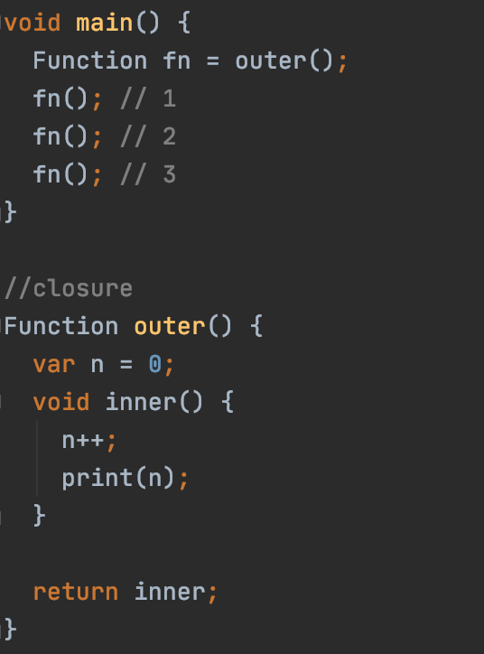
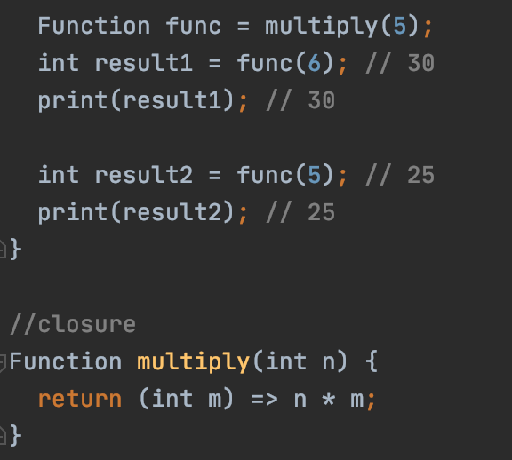

# Функции
[На главную](../dart.MD)

## Ключевые ресурсы
> - https://dart.dev/guides/language/language-tour#lexical-closures
> - https://livebook.manning.com/book/dart-in-action/chapter-4/1

## О функциях
Когда программа становится больше 10 строчек когда, полезно использовать функции.
В отличие от более строгих языков программирования, таких как Java или C#,
Dart больше похож на JS или Kotlin. Программа на Dart может состоять из одних функций.
В Dart все является объектами, в том числе функции, а это означает,
что функцию можно сохранить в переменной и передавать из одного места 
приложения в другое точно так же, как String, int или любой другой объект.

## Тип возвращаемого значения
### Getter
Когда после выполнения всех операций, функция должна вернуть некий результат,
необходимо использовать тот тип данных, которая она возвращает. Например,
вычисление среднего арифметического массива.

### Setter
Когда после выполнения всех операций, функция должна просто завершиться,
необходимо перед названием функции использовать тип данных void. Например,
вывод логов в консоль.

## Параметры функции
Иногда, чтобы передать внутрь функции значения для работы, нужно воспользоваться параметрами.

### Обязательные параметры
Если все параметры должны инициализироваться из вне, необходимо использовать обязательные параметры.

### Опциональные параметры
Иногда некоторые параметры удобно ициализировать по умолчанию.
Тогда можно воспользоваться опциональными параметрами. Они бывают двух видов.
С наименованием и без наименования.

## Анонимные функции
Когда в качестве параметра функции необходимо использовать другую функцию, то очень удобно
использовать анонимную функцию. Это та же самая функция, только без названия. Наиболее частый
пример - метод `.forEach(void f(T element))`. На каждой итерации цикла, внутри метода `foreach`
вызывается функция из параметров, с переданным элементом во внутрь. Анонимная функция реализуется
при вызове метода.

 
## Вложенные функции
Когда необходимо скрыть одну функцию внутри другой - используйте вложенные функции.
Чтобы вложенная функция заработала, ее вызов должен располагаться после объявления.

## Замыкания
Замыкание - это функция, содержащая в себе ссылки на переменные из внешней области видимости.
Т.е. она "замыкает" внешние переменные в себе.
Примеры приведены с сайта [Metanit](https://metanit.com/dart/tutorial/3.6.php)

Функция `outer` задает область видимости, в которой определены внутренняя функция `inner` 
и переменная `n`. Это окружение для функции `inner`. В функции inner увеличивается переменная
n и выводится на консоль. В конце функция outer возвращает функцию `inner`.
Поскольку функция outer возвращает функцию `inner`, то переменная fn будет хранить ссылку
на функцию `inner`. При этом эта функция запомнила свое окружение - то есть внешнюю переменную `n`.

Еще один пример замыкания

Итак, здесь вызов функции `multiply` приводит к вызову другой внутренней функции.
Внутренняя функция: запоминает окружение, в котором она была создана, в частности,
значение параметра `n`. В итоге при вызове функции `multiply` определяется переменная `func`,
которая и представляет собой замыкание, то есть объединяет две вещи: функцию и окружение,
в котором функция была создана. Окружение состоит из любой локальной переменной или любого
параметра, которые были определены в области действия функции `multiply` во время создания
замыкания. То есть `fn1` — это замыкание, которое содержит и внутреннюю функцию` (int m) => n * m`,
и параметр n, который существовал во время создания замыкания.

## Пример
[functions.dart](functions.dart)