# Циклы
[На главную](../dart.md)

## Ключевые ресурсы
>- https://dart.dev/guides/language/language-tour#control-flow-statements (EN) - официальная документация по циклам

## О циклах
Циклы позволяют в зависимости от определённых условий выполнять определённое действие множество раз.
В языке Dart есть следующие виды циклов.

## Циклы со счётчиком или цифровые циклы
Чаще всего применяются когда необходимо выполнить цикл n раз.
Например посчитать среднее арифметическое массива чисел, или вычислить все чётные значения от 0 до 100 и тд.

### for - цикл со счётчиком
Чаще всего цикл со счётчиком состоит из тех частей:
1) Объявление счётчика. Может быть int или double.
2) Условие выполнение цикла. Указывается до каких пор следует
   выполнять цикл.
3) Шаг цикла. Указывает ширину шага за один проход цикла.

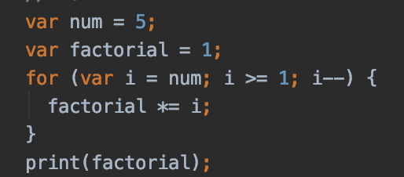

Но иногда встречаются нестандартные циклы. Например для вычисления 
чисел Фибоначчи в цикле можно задавать дополнительные параметры для каждого блока.

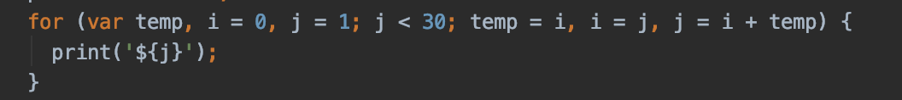

Пример еще одного нестандартного цикла - бесконечный цикл

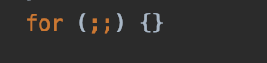

### for..in - перебор списков
Когда необходимо перебрать коллекцию без использования индексов, удобно использовать цикл for in.
Состоит из двух частей:
1) Переменная, в которую будут подставляться значения коллекции каждую итерацию
2) Ссылка на необходимую коллекцию

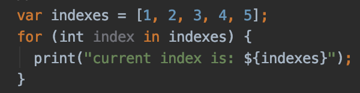

В качестве альтернативы, можно использовать метод .forEach у коллекций.
В качестве аргумента принимается функция, с аргументом равным значению
элемента цикла на текущей итерации.

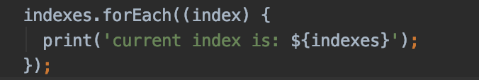

## Логические циклы
Применяются когда необходимо выполнять цикл до какого-то определённого условия.
Например "показывать уведомления, пока пользователь не принял лицензионное соглашение".

### while - цикл с предусловием.
Сперва выполняется проверка условия, затем выполняется тело цикла, пока условие == true

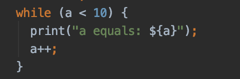

### do while - цикл с постусловием
Иногда необходимо выполнить цикл хотя бы один раз, даже если условие == false.
Часто используется, когда необходимо реализовать консольный ввод команд.

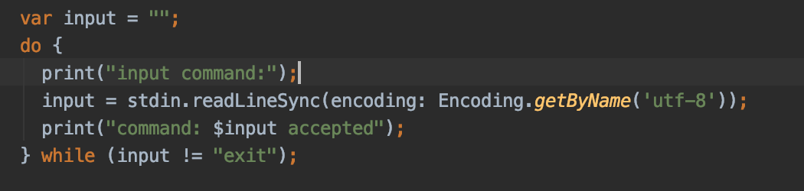

## Прерывания цикла
Иногда в ходе выполнения цикла его необходимо прервать или прекратить текущую итерацию и 
перейти к следующей.

### break
Ключевое слово break прерывает текущую итерацию;
Используется, когда необходимо прервать выполнение цикла.
Например если игрок потратил все жизни, необходимо завершить игру.

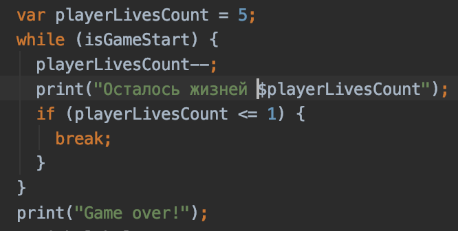

### continue
Ключевое слово continue прерывает текущую итерацию цикла и начинает цикл заново.
Например можно использовать, когда необходимо не пропускать пользователя дальше,
пока он не выполнит определённое условие.

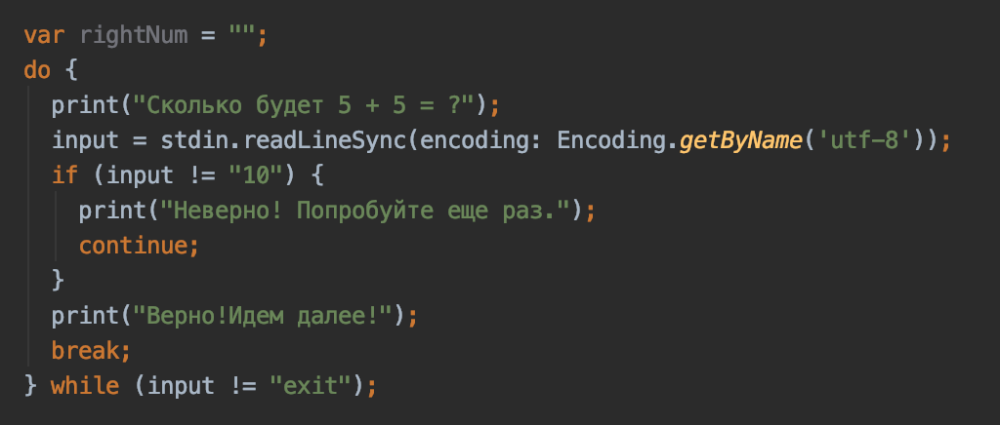

Если необходимо вычислить все нечетные числа в последовательности - continue тоже подойдет.

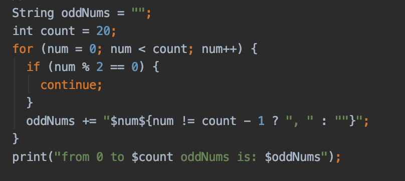

## Label
В языке Dart есть конструкция, похожая на goto из qbasic! 
При помощи ключевого слова label можно пометить определенный блок кода,
и при необходимости начинать цикл заново с этой точки или прервать цикл.

Пример с break

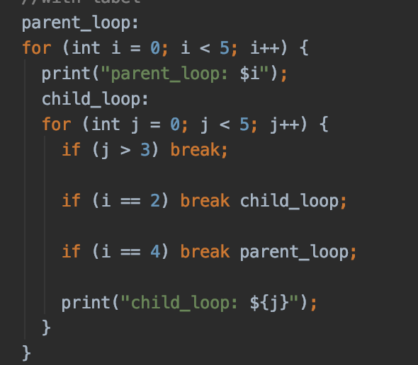

Пример с continue

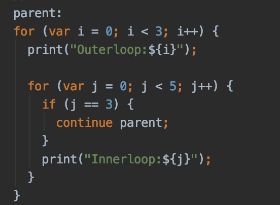

## Пример 
[loops.dart](loops.dart)

## Дополнительные материалы
>- https://medium.com/@liemvo/array-sort-algorithms-in-dart-language-c9ca270cedfb (EN) - примеры сортировок, выполненных с помощью циклов