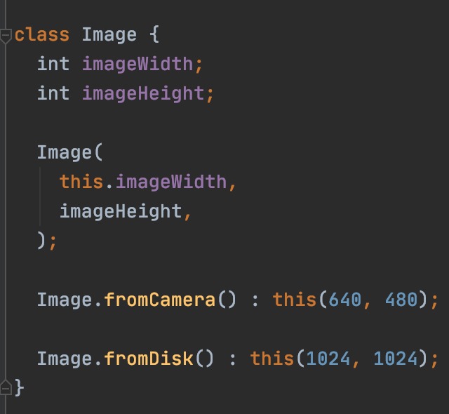

# ООП
[На главную](../../dart.md)

##Дополнительные материалы
https://dart.dev/guides/language/language-tour#classes (EN) - официальная документация по классам

Dart - объектно-ориентированный язык программирования.
Модель ооп предполагает, что программа оперирует объектами.
Объект – это область памяти компьютера, в которой хранятся данные в работающем приложении.
Объекты описываются с помощью классов. Класс - это некий чертеж, по которому 
компилятор создаст объект в памяти компьютера. Важное отличие:
Класс всегда один, но объектов, созданных по классу может быть много.

## Как устроен класс
Каждый класс состоит из блока переменных, геттеров/сеттеров, конструктора и функций.
Классы могут отличаться друг от друга - где-то есть наследование, 
реализация интерфейса или дженерик, но общая структура всегда остается одинаковой.

### Геттеры и сеттеры
Каждый объект может иметь какие-либо свойства. Имя игрока, количество жизней,
мана, стамина и тд. Эти данные записываются в свойства. Чтобы в них можно
было записывать значения существуют геттеры и сеттеры. Это методы, предоставляющие
доступ на чтение и запись свойств.

Каждое свойство в данном классе имеет неявный setter для записи в него и неявный getter для получения значения.
Когда происходит инициализация переменной - срабатывает setter.
Когда происходит обращение к переменной - срабатвает getter.

Инициализировать объекты можно в ручную.

Также можно инициализировать через конструктор.

Существует явная запись геттера и сеттера.
Такой подход удобен тем, что можно инициализировать
свойства объекта, исходя из входящих параметров конструктора.

Пример явного геттера

Пример явного сеттера

### Конструкторы

Объект, перед тем как начать свою работу - инициализируется в памяти.
При инициализации объекта, первая функция которая срабатывает внутри него - конструктор(инициализатор).
Он позволяет задать параметры и инициализировать свойства, которые необходимы объекту для работы.
Например, для того, чтобы создать игрока расы орков, в этот объект необходимо передать 
значение `race = "orc"`

### Именованные конструкторы
Иногда для объекта необходимо сделать различные сценарии инициализации. Например файл
в программу можно загрузить из интернета, из файлового хранилища, из камеры и тд.
Для этого можно воспользоваться именованными конструкторами.

### Вызов родительского конструктора
Когда два объекта связаны наследованием, для инициализации дочерних объектов
необходимо инициализировать родительский конструктор, т.к в нем содержатся
базовые свойства, присущие всем типам текущей иерархии классов.
Родительский конструктор вызывается ключевым словом `super`

Если у родительского типа будет только именованный конструктор - вызывать необходимо его

### Список инициализации
Иногда бывает необходимо инициализировать некоторые переменные до того, как конструктор начнет выполнение.
Тогда необходимо использовать список инициализации.

### Перенаправление конструктора
Иногда требуется вызвать один конструктор через другой. 

### const конструктор
Когда требуется создать объект, у которого инициализируемые свойства
не должны изменяться - у конструктора необходимо объявить 
модификатор const. Так-же экземпляр класса станет доступным для создания в статическом
контексте и за пределами класса.

### factory
_пример взят из книги Dart in Action-Chris Buckett_

Помимо синтаксиса конструкторов, аналогичного Java и C#, в Dart имеется понятие
фабричного конструктора (factory constructor). Можно определить базовый класс,
используемый как интерфейс, и включить в него фабричный конструктор, который
предоставит конкретный экземпляр по умолчанию. Это особенно полезно, когда в большинстве
случаев требуется всего одна реализация некоторого интерфейса.

### static
Статические методы и переменные инициализируются во время компиляции приложения и работают
, пока приложение не завершит выполнение. Несмотря на то, что эти объекты описаны
внутри класса, они не принадлежат объекту, созданному по этому классу. static часто
применяется, когда необходимо создать утилитный объект.

## Пример
[oop.dart](oop.dart)

## Дополнительные материалы
Подробное описание ООП в дарт на Metanit

https://metanit.com/dart/tutorial/4.1.php (RU)

https://metanit.com/dart/tutorial/4.2.php (RU)