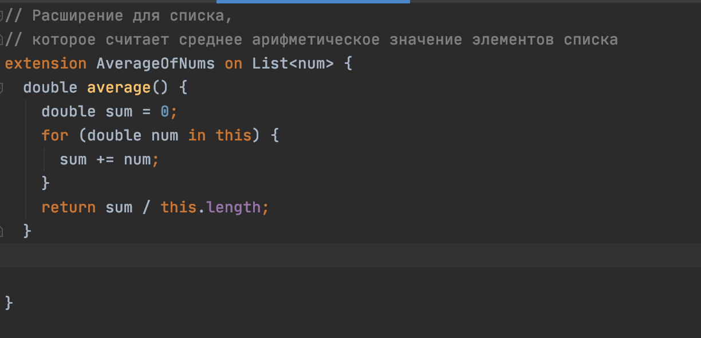
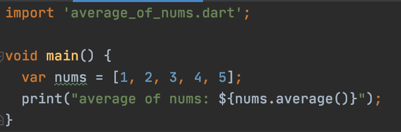
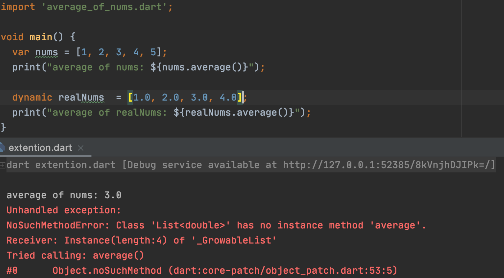
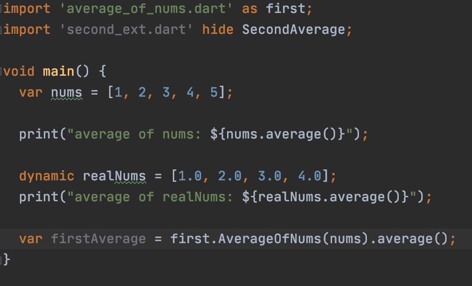

# Расширения
[К оглавлению](../oop.md)

## Ключевые ресурсы
>- https://medium.com/dartlang/extension-methods-2d466cd8b308 (EN) - подробная статья про использование расширений
>- https://dart.dev/guides/language/language-tour#extension-methods (EN) - официальная документация
>- https://dart.dev/guides/language/extension-methods (EN) - более подробная документация

## О расширениях
Расширения позволяют расширить функционал в существующем классе, без добавления нового типа данных.

### Использование расширений

Чтобы расширение класса стало доступно, необходимо использовать импорт.

### Статические и динамические типы

Расширения работают только со статически типизированными переменными. Это связно с тем, что
тип, на который накладывается расширение, определяется во время компиляции. Т.е если расширение
предназначено только для строк - они будут работать только с типом данных String, но в dynamic может
попасть любой тип данных.

### Конфликты расширений

Когда несколько расширений используют одно и то же api, могут происходить конфликты. Для решения
конфликтов можно использовать префиксы или скрывать необходимые расширения.

## Пример
[extention.dart](extention.dart)

[average_of_nums.dart](average_of_nums.dart)

[second_ext.dart](second_ext.dart)
