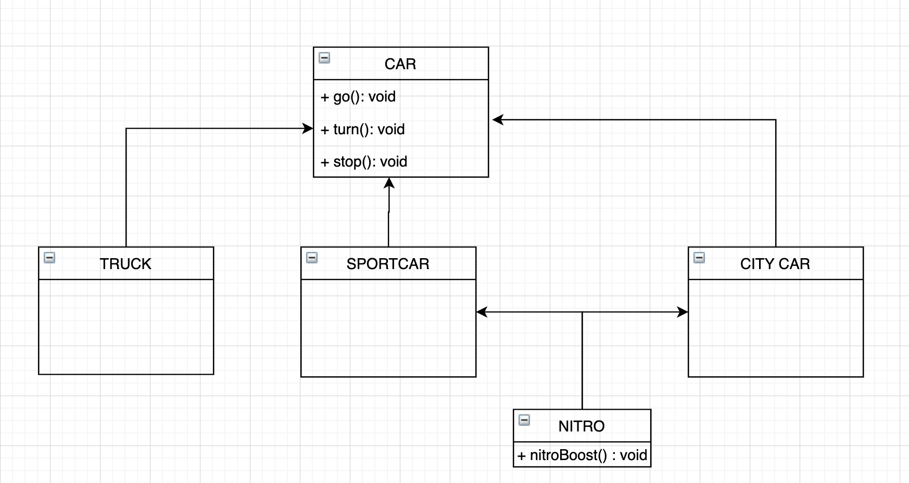
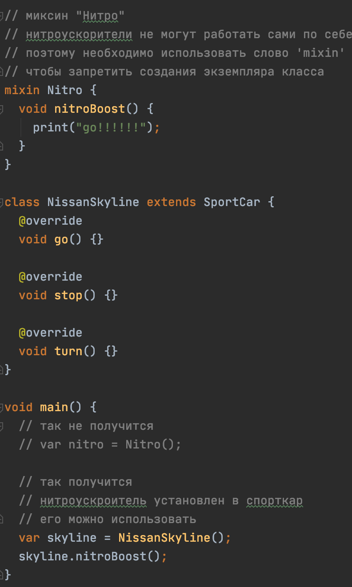
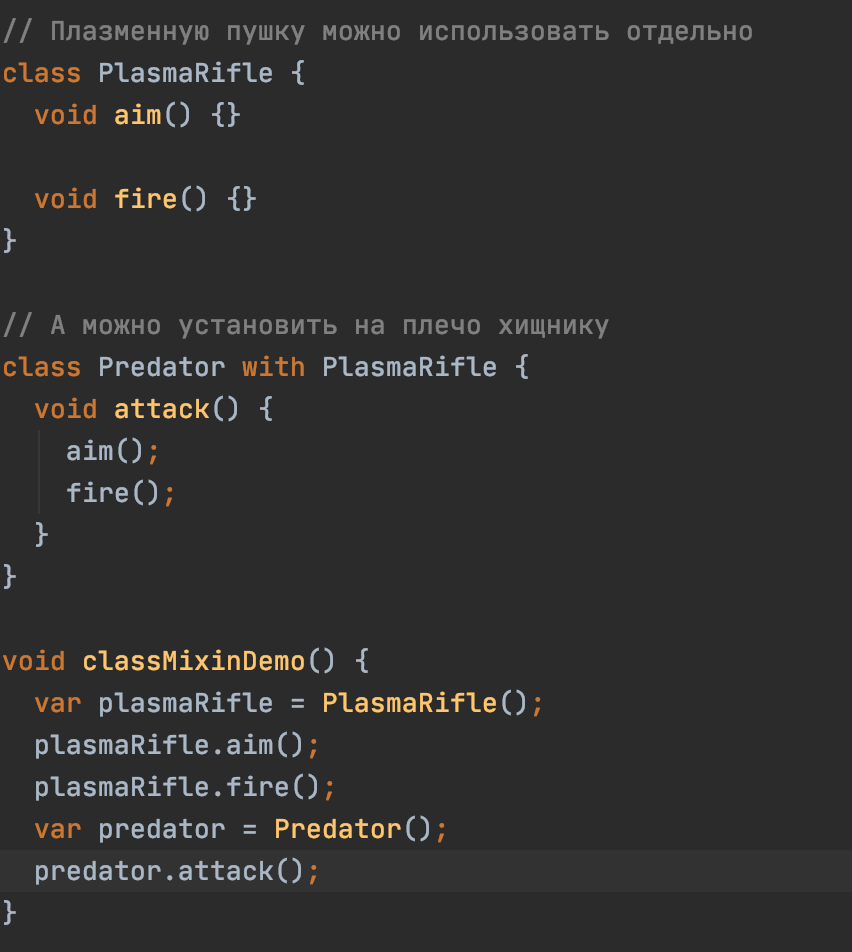
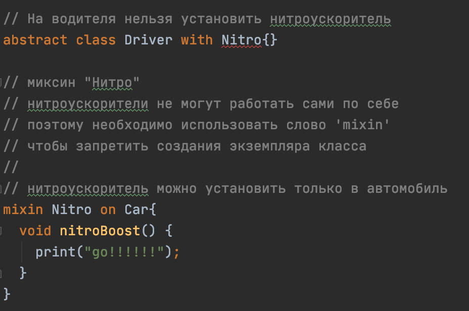

# Миксины

## Дополнительные материалы
> - https://habr.com/ru/post/484206/ (RU) - в статье рассказано когда необходимо применять миксины
> - https://medium.com/flutter-community/dart-what-are-mixins-3a72344011f3 (EN) - еще одна подробная статья про миксины
> - https://dart.dev/guides/language/language-tour#adding-features-to-a-class-mixins (EN) - официальная документация про миксины

## О миксинах
Миксин предоставляют возможность использовать код в различных иерархиях наследования.
Иногда необходимо внести общий функционал в объекты, состоящие в различных ветках наследования, 
без добавления этого функционала в супер-класс.

## Реализация миксинов

- При помощи ключевого слова `mixin`. 
  В таком случае, объект можно будет использовать только "подмешивая" к другим объектам.

- В качестве миксина можно использовать обычный класс. Применяется, когда функционал класса
необходимо создавать в качестве отдельного объекта.

- Используя ключевое слово `on`, применение миксина можно ограничить только в определенном типе данных. 

