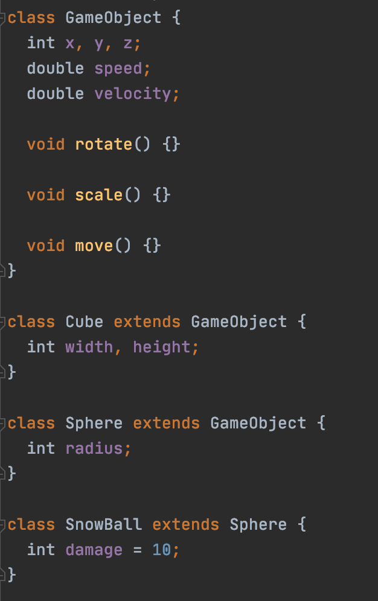
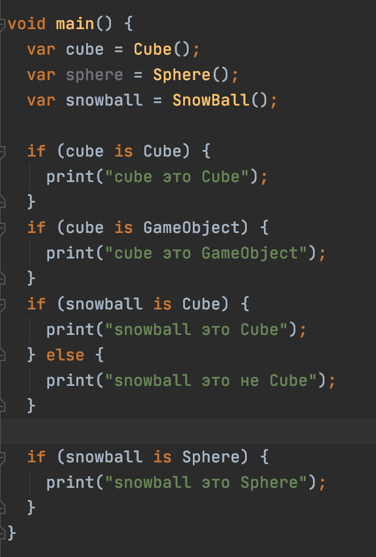

#Паттерны объектно-ориентированного программирования
ООП состоит из четырех основных принципов. Наследование, полиморфизм, инкапсуляция, абстракция.

##Наследование
ООП существует благодаря этому паттерну. 
Наследование позволяет передавать функционал от одних объектов другим. Благодаря этому
есть возможность создавать иерархию похожих друг на друга объектов без дублирования кода.

###Приведение типов
Нисходящее преобразование типов в dart работает по умолчанию.
Благодаря этому можно определять, какой иерархии типов принадлежит объект.

Для восходящего приведения типов необходимо использовать ключевое слова `as`,
либо типизировать переменную.
