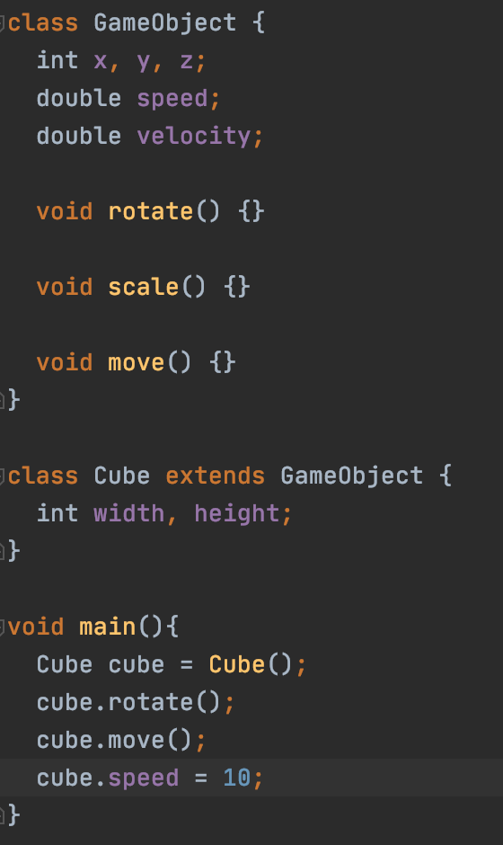
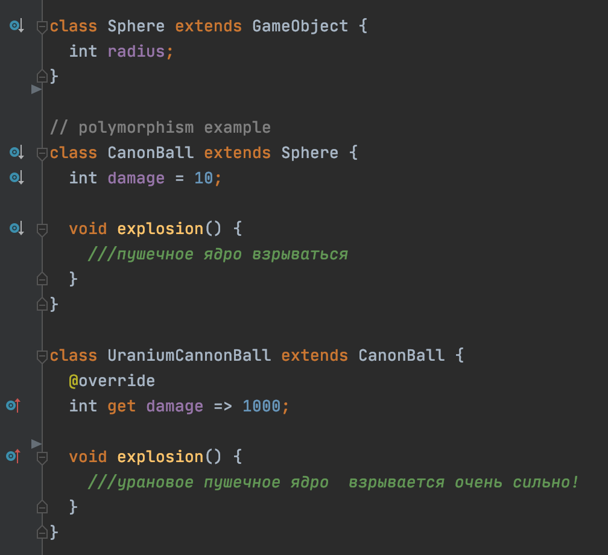
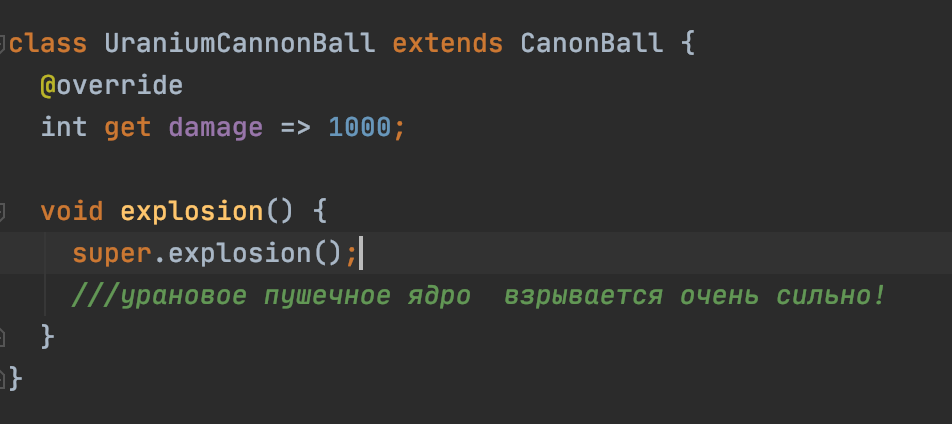
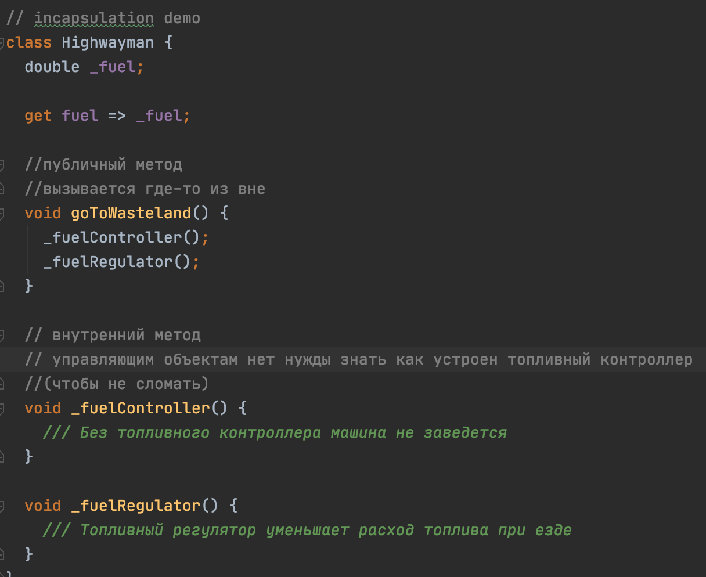
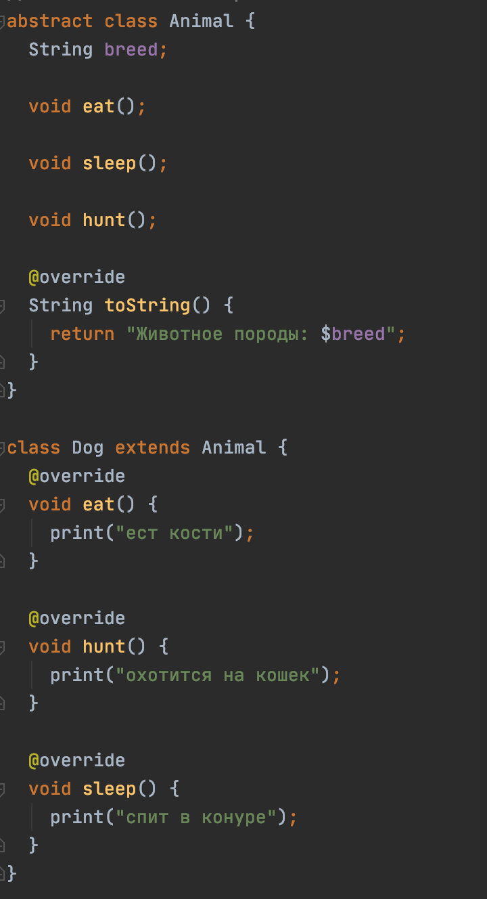
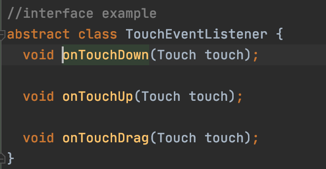
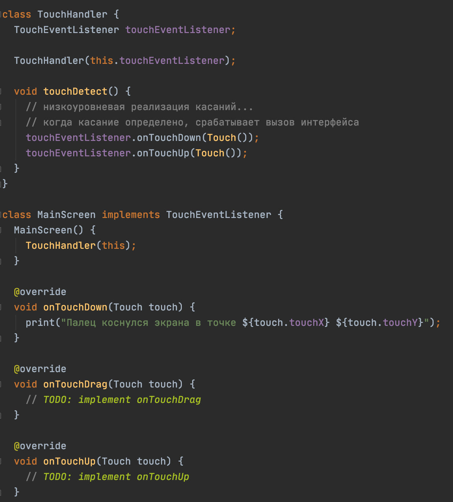

# Паттерны объектно-ориентированного программирования
[К оглавлению](../oop.md)

## Дополнительные материалы
> - https://dart.dev/samples#interfaces-and-abstract-classes (EN) - официальная документация по абстрактным классам и интерфейсам

## О паттернах
ООП состоит из четырех основных принципов. Наследование, полиморфизм, инкапсуляция, абстракция.

### Наследование
ООП существует благодаря этому паттерну. 
Наследование позволяет передавать функционал от одних объектов другим. Благодаря этому
есть возможность создавать иерархию похожих друг на друга объектов без дублирования кода.

### Полиморфизм
Полиморфизм – это способность программы идентично использовать объекты с одинаковым интерфейсом без информации о конкретном типе этого объекта.
У каждого объекта реализация интерфейса может отличаться от родительской.
Перезаписывать можно только методы(переменные можно переопределить, но задать другой тип нельзя).
Чтобы перезаписать метод, необходимо указать то же название метода и список параметров, что и у родителя.
Тип возвращаемого значение может быть другим. В отличии от Java, в Dart все публичные методы 
и переменные(даже если это константа в родителе) можно перезаписать.

### super
Чтобы вызвать родительскую реализацию метода, или конструктора используется ключевое слово `super`

### Инкапсуляция
Инкапсуляция это скрытие внутреннего функционала объекта. Применяется, чтобы разделить публичный интерфейс управления
объектом, от его "начинки". В Dart для этого используется модификатор доступа `_` - аналог private из Java.

### Абстрактные классы
Когда необходимо спроектировать сложную систему классов, в качестве корневого элемента можно использовать абстрактный класс.
Ключевое отличие абстрактного класса от обычного - это возможность создания методов без реализации. Это полезно, когда в родительском
классе необходимо лишь задать интерфейс управления объектов. Так-же нельзя создавать экземпляры абстрактного класса.
Чтобы объявить абстрактный класс, необходимо использовать ключевое слово `abstract`.

### Интерфейс
Интерфейсы применяется для реализации контракта между объектами. Например, когда необходимо обработать события 
касания по экрану, то низкоуровневая реализация отвечает за получения событий с экрана, а в том месте, где
эти события должны быть обработаны, реализуется контракт. Таким образом обработка какого-либо события не привязано 
к месту, где это событие определяется.

Пример создания интерфейса.

 
Пример абстрактной реализации подписки на события касания по экрану

## Пример
[patterns.dart](patterns.dart)

## Дополнительные материалы
> - https://habr.com/ru/post/463125/ (RU) - подробная статья про ООП с картинками

