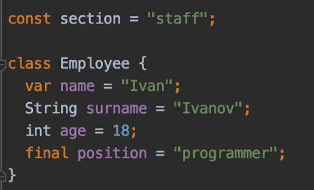

# Переменные во Flutter
[На главную](../dart.MD)

## Ключевые ресурсы
> - https://dart.dev/guides/language/language-tour#variables (EN) - официальная документация по переменным

## О переменных 
Для хранения данных в Dart используются переменные.
Имя переменной может содержать алфавитные символы, числа, знак подчеркивания.
Имя переменной не должно совпадать с ключевыми словами, зарезервированными системой.

## Пример определения переменных
Переменные можно определить несколькими способами:

- С явным указанием типа данных. Тип данных это встроенный или кастомный тип (Строки, числа, массивы, модель данных).

- С помощью ключевого слова var. При первой инициализации переменной происходит запоминание присваемого типа и дальнейшее
изменение типизации невозможно.

- С помощью ключевого слова final. Такой способ применяется когда необходимо создать константу во время выполнения 
программы.

- С помощью ключевого слова const. Такой способ применяется когда необходимо создать константу во время компиляции.

## Виды переменных 
В зависимости от места определения переменной, область ее видимости будет различаться.

- Если объявить переменную внутри функции – это локальная переменная. Она будет доступна только внутри функции.

- Если объявить переменную внутри класса – это переменная класса. Она доступна на уровне класса и из других классов,
если она не приватна.

- Если объявить переменную вне класса – это будет глобальная переменная. Она доступна на уровне всего приложения.
Как правило(но необязательно) это константы.

## Исходники 
[variables.dart](variables.dart)

