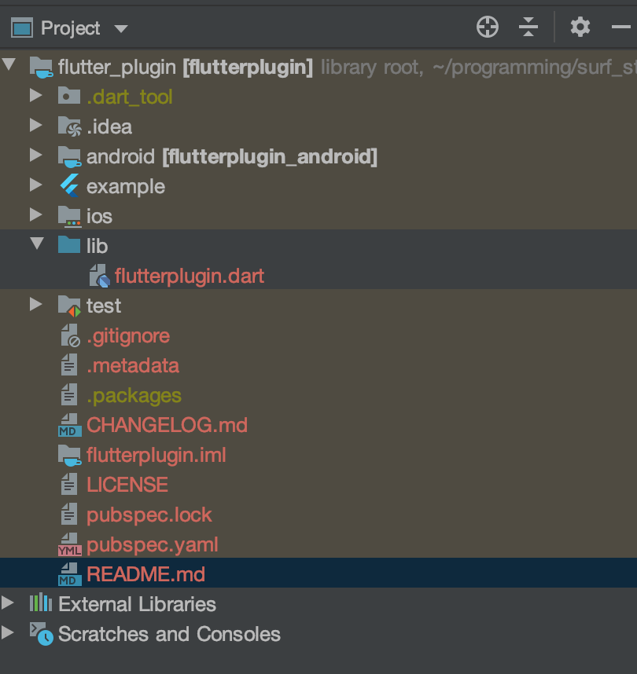

[На главную](../flutter.md)

# Структура Flutter проектов

## Ключевые ресурсы
>- https://flutter.dev/docs/get-started/test-drive?tab=androidstudio (EN) - про создание проекта
>- https://flutter.dev/docs/development/packages-and-plugins/developing-packages (EN) - про разработку пакетов и плагинов
>- https://flutter.dev/docs/development/packages-and-plugins/using-packages (EN) - про использование пакетов
>- https://dart.dev/tools/pub/pubspec (EN) - про pubspec
>- https://flutter.dev/docs/development/add-to-app/android/project-setup (EN) - про интеграцию модулей

## О видах проектов
Приложения на Flutter имееют несколько видов

### Flutter Application

Приложение для конечных пользователей

Структура Flutter приложения состоит из:
- Android, Ios, Web - папки с приложениями для нативных платформ
- lib - папка с исходным кодом
- test - папка с юнит тестами
- pubspec.yaml - метадата проекта. этот файл описывает конфигурацию проекта, типы сборок, зависимости, используемые ресурсы.
аналог build.gradle из android
- pubspec.lock - хранит версии зависимостей, используемых в проекте
- .packages - системный кэш пакетов, от которых зависит проект

[Более подробно про pubspec.yaml, pubspec.lock и .packages](https://dart.dev/guides/packages) описано в офф.документации

- external libraries - содержит внешние фреймворки для разработки. Например Android SDK, Dart SDK

Запуск проекта происходит в функции `main(){runApp(app_name)}`

### Flutter Plugin 
Нативный плагин для Ios или Android используемый во Flutter приложении.

Имеет схожую структуру с обычным Flutter приложением. Так-же содержит демонстрационный проект, в
котором показано использование плагина. Плагин можно запускать только внутри Flutter приложения.
Как правило, плагины предназначены для взаимосвязи с нативной платформой, с использованием [MethodChannel](https://flutter.dev/docs/development/platform-integration/platform-channels)

### Flutter Package
Компонент, написанный на Dart, не имеющий связи с нативными платформами. 
В структуре проекта отсутствуют папки, содержащие приложения для Android, Ios или Web.
Это может быть утилита или новый виджет.

### Flutter Module 
Компонент, предназначенный для [интеграции](https://flutter.dev/docs/development/add-to-app/android/project-setup) в нативное Ios/Android приложение.
Имеет схожую структуру с обычным приложением.

## Примеры
[flutter_app](examples/flutter_app) - пример приложения на Flutter

[flutter_module](examples/flutter_module) - пример модуля на Flutter

[flutter_package](examples/flutter_package) - пример пакета на Flutter

[flutter_plugin](examples/flutter_plugin) - пример плагина на Flutter