# Контейнеры
В этом разделе собраные материалы по использованию наиболее часто встречающихся контейнеров

## Оглавление
[Назад к layout](../layout.md)

## Ключевые ресурсы
>- https://flutter.dev/docs/development/ui/widgets/layout (EN) - про виджеты разметки
>- https://flutter.dev/docs/development/ui/widgets/scrolling (EN) - про прокручиваемые виджеты разметки

### Container
Наиболее часто встречаемый виджет.Является "контейнером общего назначения".
Используется для добавления виджету отступов, настройки параметров фона виджета, добавления теней, 
установки размеров дочернего виджета и тд

```dart
 Widget buildContainer() {
    return Container(
      width: 100,
      height: 100,
      padding: EdgeInsets.all(8),
      margin: EdgeInsets.all(8),
      alignment: Alignment.center,
      decoration: BoxDecoration(
        shape: BoxShape.rectangle,
        color: Colors.red,
        border: Border.all(width: 2, color: Colors.blue),
        borderRadius: BorderRadius.all(Radius.circular(8)),
        backgroundBlendMode: BlendMode.multiply,
        gradient: LinearGradient(
          colors: [Colors.deepOrange, Colors.yellow],
          stops: [0.0, 0.7],
        ),
        boxShadow: [
          BoxShadow(
            color: Colors.grey.withOpacity(0.5),
            spreadRadius: 5,
            blurRadius: 7,
            offset: Offset(0, 3), // changes position of shadow
          ),
        ],
      ),
      transform: Matrix4.identity()..scale(1.0),
      clipBehavior: Clip.none,
    foregroundDecoration: BoxDecoration(
        border: Border.all(
          color: Colors.white,
          width: 2,
        ),
        shape: BoxShape.circle,
      ),
      constraints: BoxConstraints.expand(),
      child: Text(
        "container",
        style: TextStyle(
          color: Colors.white,
        ),
      ),
    );
  }
```
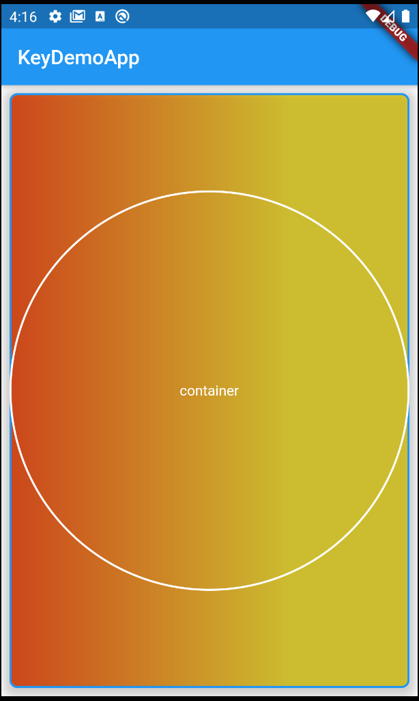

Имеет следующий функционал:

- `width`, `height` - Ширина и высота контейнера.

- `padding` - Внутренний отступ в контейнере

- `margin` - Внешний отступ от контейнера

- `alignment` - Выравнивание дочернего виджета. Конфигурируется при помощи готовых пресетов либо с помощью задания
координат через конструктор

- `decoration` - Конфигурация бэкграунда контейнера. С помощью этого параметра можно преобразить внешний вид контейнера
    - `shape` - Конфигурация фигуры контейнера. Овал либо прямоугольник
    - `color` - цвет фигуры
    - `border` - стиль рамки
    - `borderRadius` - радиус рамки
    - `backgroundBlendMode` - режим наложения цвета
    - `gradient` - наложение градиента на цвет фона
    - `boxShadow` - массив теней
 - `transform` - трансформационная матрица контейнера. С помощью нее можно производить матричные преобразования объекта,
    например вращение, перемещение, маштабирование и тд
- `clipBehavior` - режим сглаживания
- `foregroundDecoration` - оформление переднего фона контейнера. Имеет аналогичные `decoration` свойства
- `constraints` - конфигурация маштабирования виджета по ширине и высоте
- `child` - дочерний виджет

### Center
Позиционирует дочерний виджет по центру родительского виджета.

```dart
  Widget centerDemo() {
    return Container(
      width: 200,
      height: 200,
      color: Colors.blue,
      child: Center(
        child: Text("text in center"),
      ),
    );
  }
```
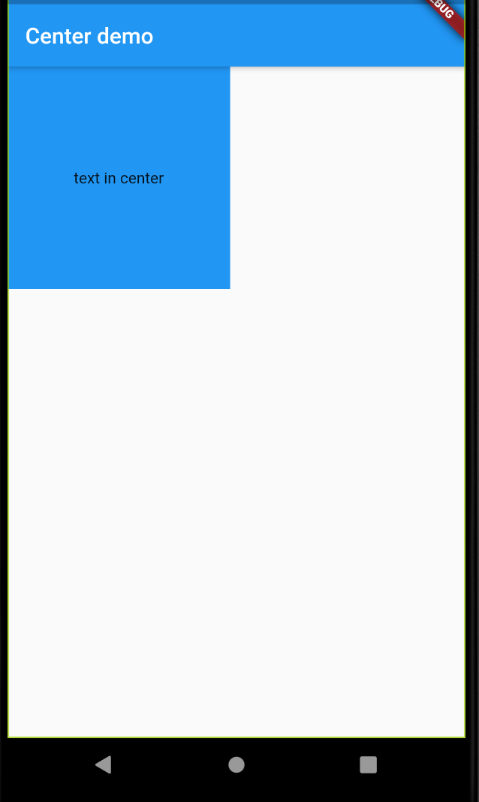

Выравнивание по центру происходит только в том случае, когда родительский виджет `SingleChildWidget` c установленным размером.
Если разместить `Center` например в `Column` выравнивания не произойдет.

```dart
  Widget centerDemo2() {
    return Container(
      width: 200,
      height: 200,
      color: Colors.blue,
      child: Column(
        children: <Widget>[
          Center(
            child: Text("text in center"),
          ),
        ],
      ),
    );
  }
```
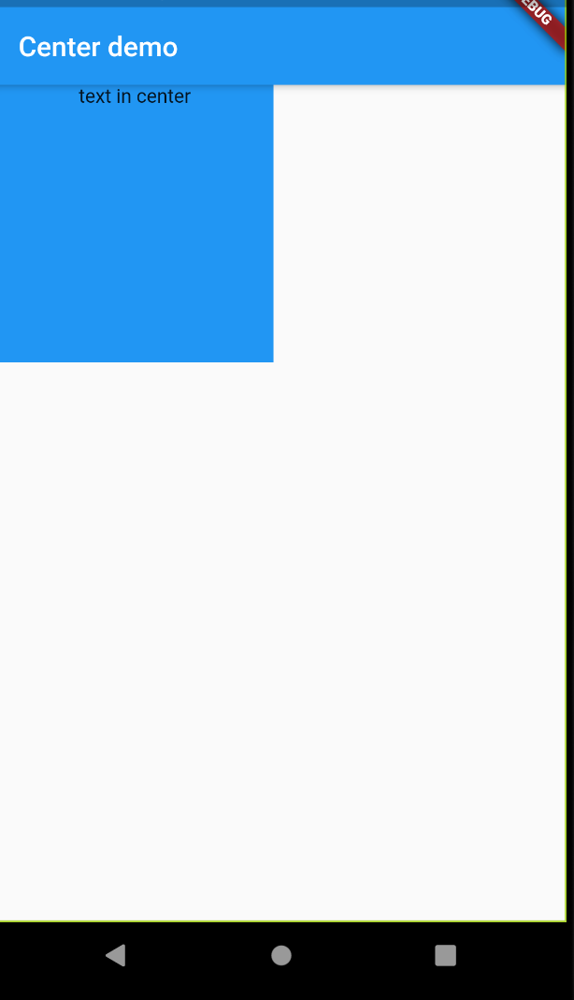

### Padding
Задает размеры отступов между элементами.

```dart
  Widget paddingDemo() {
    return Container(
      color: Colors.blue,
      child: Padding(
        /// отступ со всех сторон
        padding: EdgeInsets.all(8.0),
          /// отступ по вертикали и горизонтали
//        padding: EdgeInsets.symmetric(vertical: 8.0, horizontal: 8.0),
          /// отступ по одной из 4 сторон
//        padding: EdgeInsets.only(left: 0, right: 0, top: 0, bottom: 0),
          /// уникальный отступ по всем сторонам
//        padding: EdgeInsets.fromLTRB(0, 0, 0, 0),
        child: Container(
          color: Colors.red,
          child: Text(
            "padding 8 px",
            style: TextStyle(
              color: Colors.white,
            ),
          ),
        ),
      ),
    );
  }
```
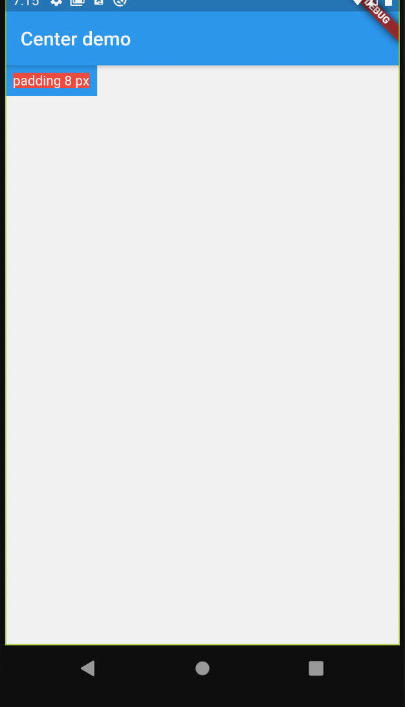

### Align
Позиционирует положение дочернего виджета внутри родительского виджета.

```dart
  Widget alignDemo() {
    return Container(
      width: 200,
      height: 200,
      color: Colors.blue,
      child: Align(
//        alignment: Alignment.center,
        alignment: Alignment(1, 1),
        child: Container(
          child: Text(
            "Align",
            style: TextStyle(color: Colors.white),
          ),
        ),
      ),
    );
  }
```

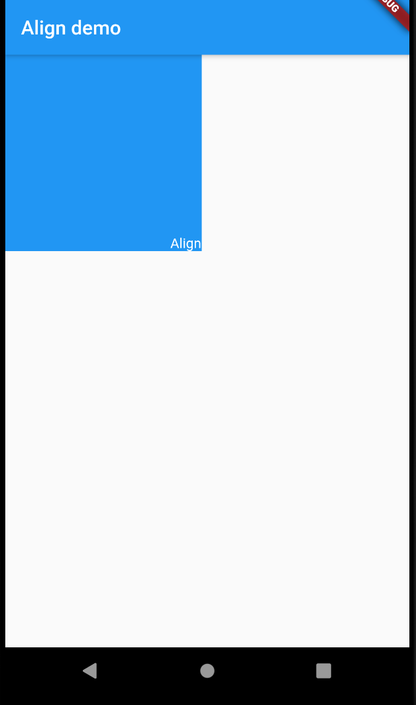

Для определения положения можно использовать один из готовых пресетов

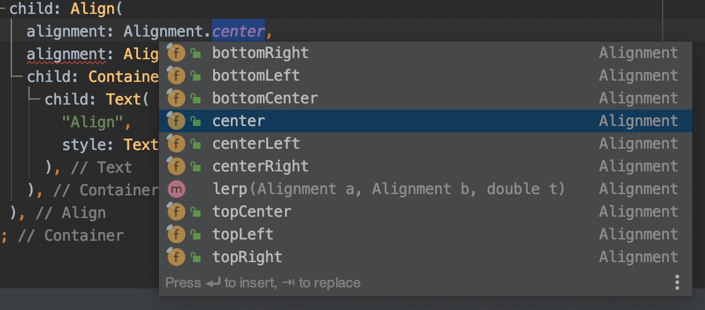

Либо воспользоваться `Alignment(double x, double y)`

```dart
child: Align(
//        alignment: Alignment.center,
        alignment: Alignment(1, 1),
        child: Container(
          child: Text(
            "Align",
            style: TextStyle(color: Colors.white),
          ),
        ),
      ),
```

При использовании `Alignment` диапазон значений задается от 0 до 1. Если привысить это значение, дочерний элемент
сместится за пределы виджета

```dart
Widget alignDemo2() {
    return Container(
      width: 200,
      height: 200,
      color: Colors.blue,
      child: Align(
        alignment: Alignment(2, 2),
        child: Container(
          child: Text(
            "Align",
            style: TextStyle(color: Colors.black),
          ),
        ),
      ),
    );
  }
```
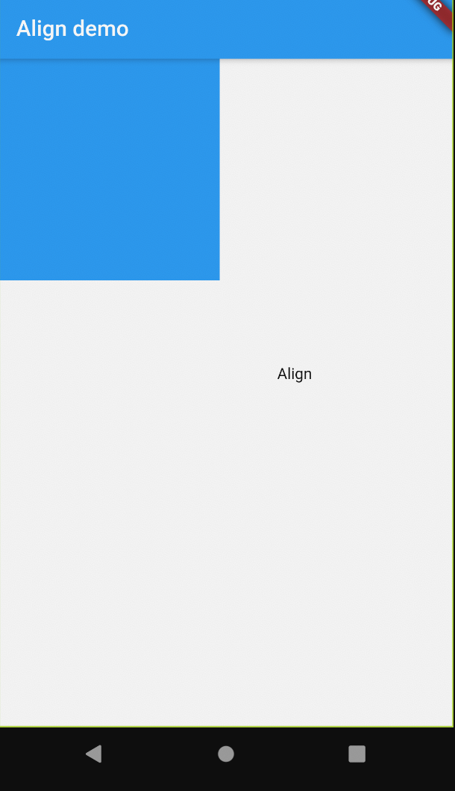

### Row
Располагает дочерние элементы в виде строки. Имеет основную ось по горизонтали, дополнительную по вертикали.

```dart
Widget rowDemo({
    MainAxisSize mainAxisSize,
    MainAxisAlignment mainAxisAlignment,
    CrossAxisAlignment crossAxisAlignment,
    TextBaseline textBaseline,
    TextDirection textDirection,
    VerticalDirection verticalDirection,
  }) {
    return Container(
      color: Colors.red,
      height: 200,
      child: Row(
        mainAxisSize: mainAxisSize,
        mainAxisAlignment: mainAxisAlignment,
        crossAxisAlignment: crossAxisAlignment,
        textBaseline: textBaseline,
        textDirection: textDirection,
        verticalDirection: verticalDirection,
        children: <Widget>[
          Text(
            "Row",
            style: TextStyle(fontSize: 10),
          ),
          Text(
            "Demo",
            style: TextStyle(fontSize: 30),
          ),
          Container(
            width: 100,
            height: 100,
            color: Colors.blue,
          ),
          SizedBox(
            width: 20,
          ),
          Container(
            width: 100,
            height: 100,
            color: Colors.blue,
          ),
          SizedBox(
            width: 20,
          ),
          Container(
            width: 100,
            height: 100,
            color: Colors.blue,
          ),
        ],
      ),
    );
  }
```
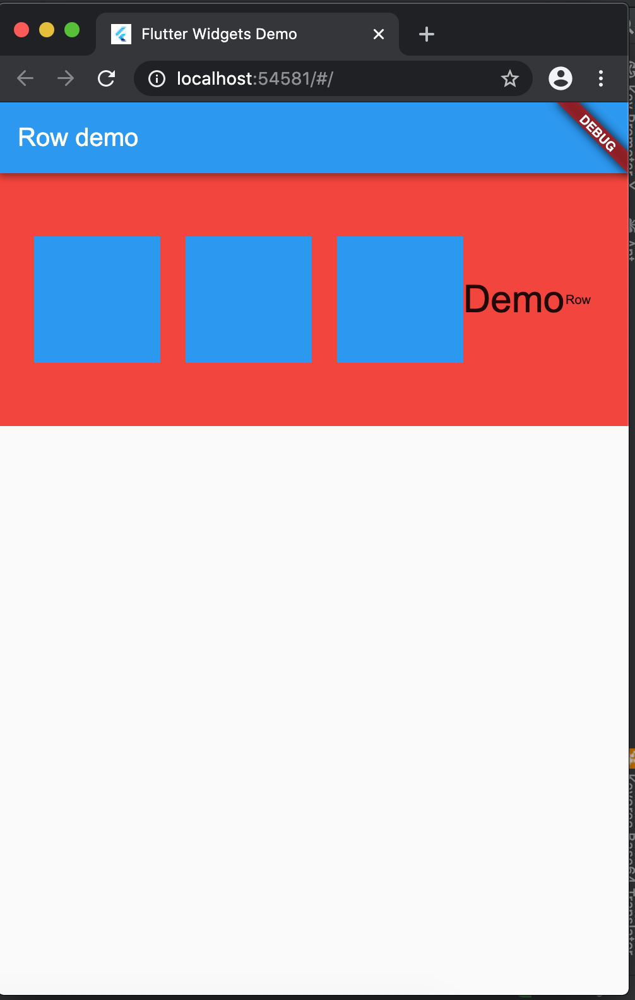

Строка имеет следующие параметры:

- mainAxisSize - максимальный размер по основной оси(по горизонтали). Имеет два значения. 
    - min - размер строки сжимается до размеров дочернего виджета
    
    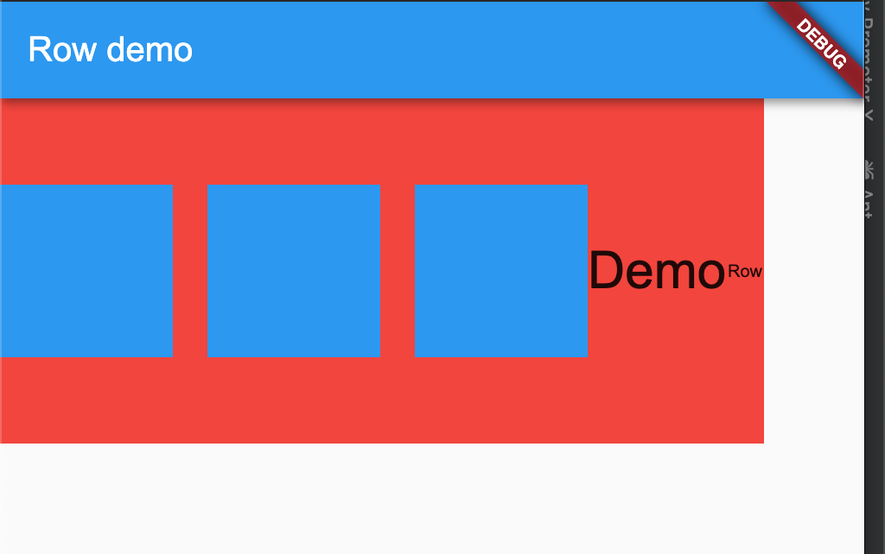
    
    - max - размер расширяется до размеров родительского виджета

    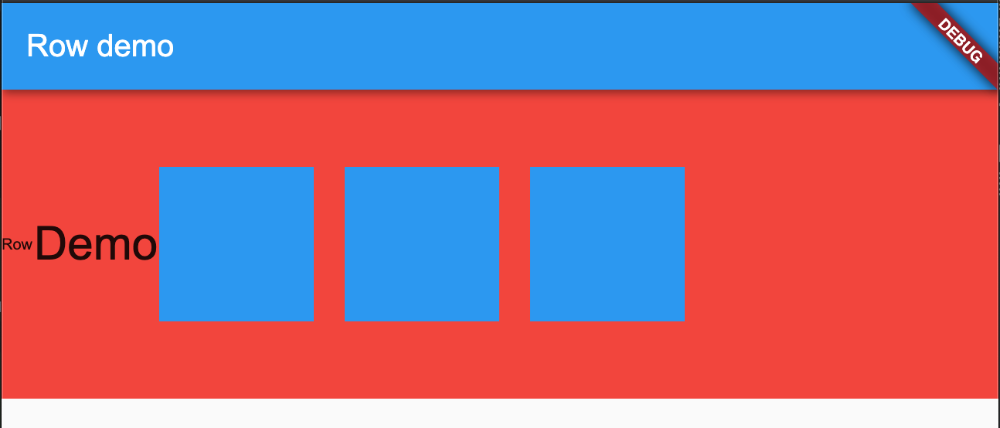

- mainAxisAlignment - позиционирования дочерних виджетов по основной оси
    - start - дочерние элементы располагаются по левому краю родительского виджета
   
   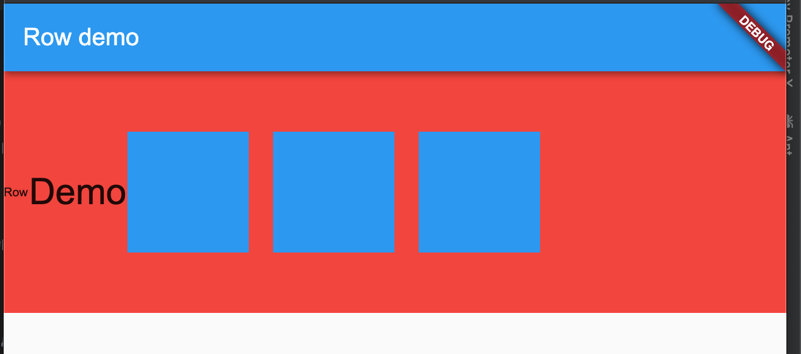
    
    - center - дочерние элементы располагаются по центру родительского виджета

   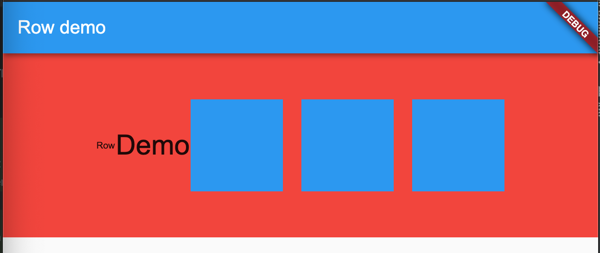
   
   - end - дочерние элементы располагаются по правому краю родительского виджета
   
   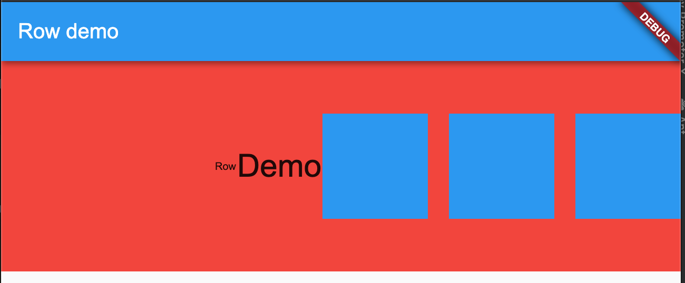
   
   - spaceBetween - между дочерними виджетами образуется свободное пространство
   
   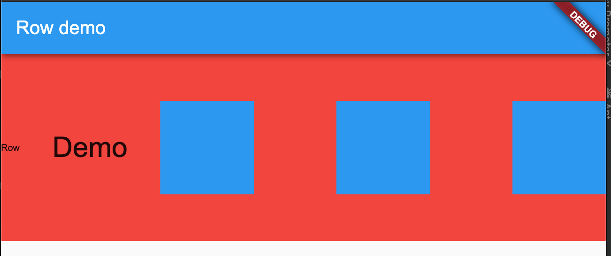   
   
   - spaceAround - между дочерними виджетами образуется свободное пространство слева и справа
   
   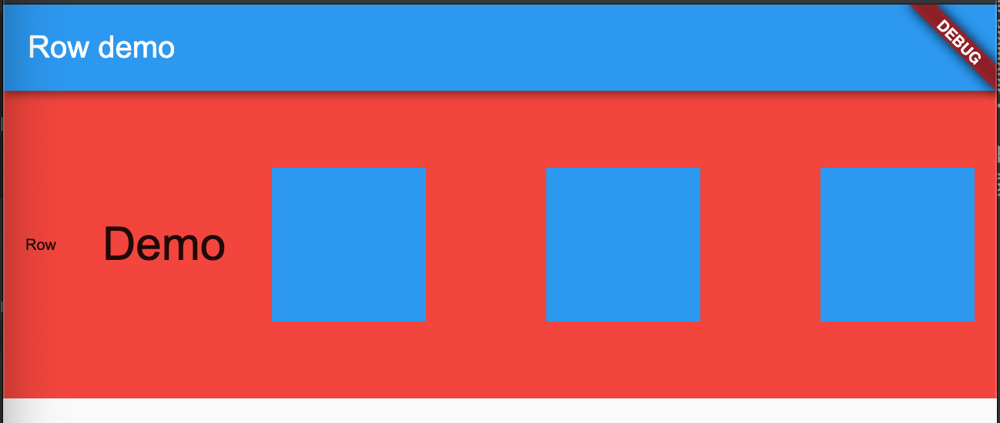    
   
   - spaceEvenly - между дочерними виджетами образуется свободное пространство слева и справа от первого до последнего виджета
   
   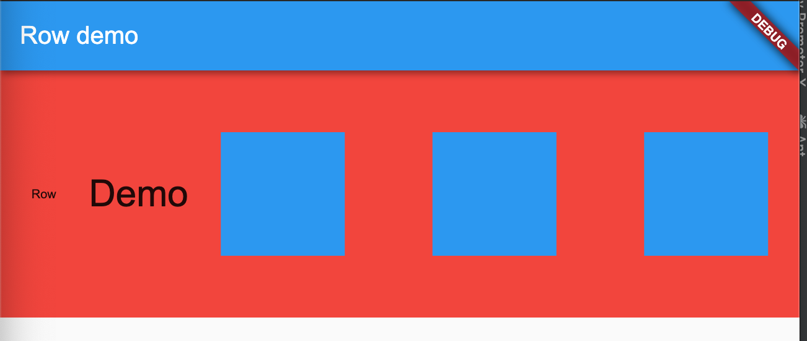

- crossAxisAlignment - позиционирование дочерних виджетов по дополнительной оси

    - start - дочерние элементы располагаются сверху родительского виджета
    
    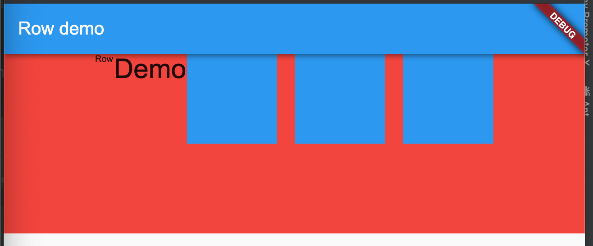
    
    - center - дочерние элементы располагаются по центру родительского виджета
    
    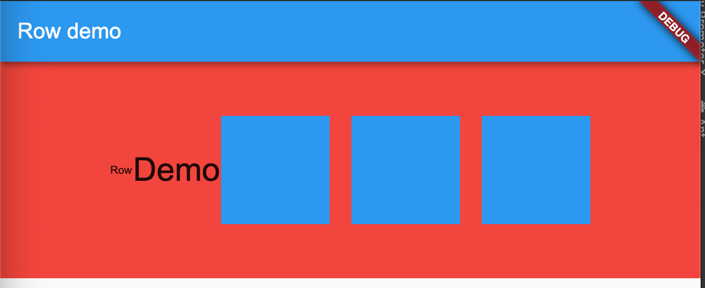   
    
    - end - дочерние элементы располагаются снизу родительского виджета
    
    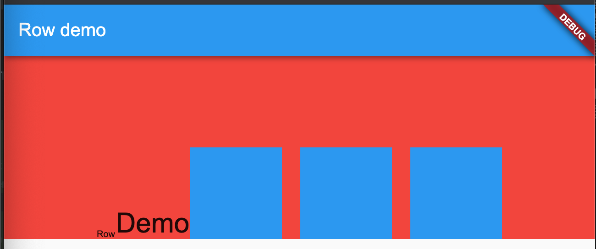 
    
    - baseline - дочерние элементы располагаются по направляющим текста
    
    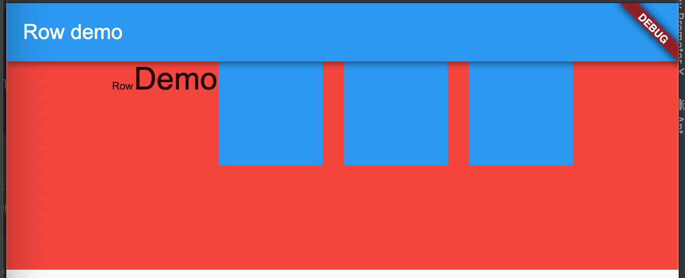
    
    - stretch - дочерние элементы растягиваются на всю ширину родительского контейнера
    
    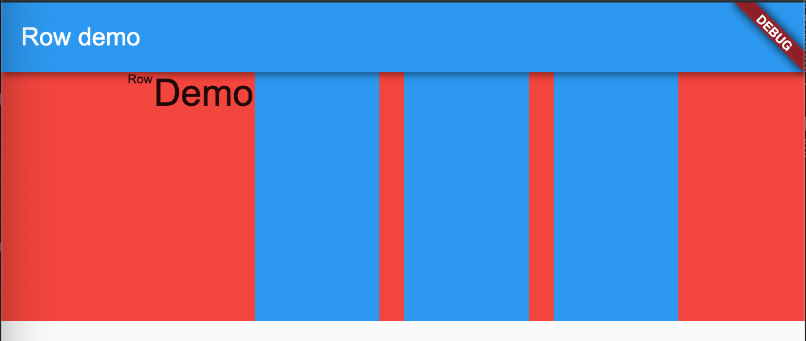 
    
- textBaseline - выравнивание текста внутри строки
    
     
   
### Column
Располагает дочерние виджеты в столбик. Имеет основную ось по вертикали, дополнительную по горизонтали

```dart
Widget columnDemo({
    MainAxisSize mainAxisSize,
    MainAxisAlignment mainAxisAlignment,
    CrossAxisAlignment crossAxisAlignment,
    TextBaseline textBaseline,
    TextDirection textDirection,
    VerticalDirection verticalDirection,
  }) {
    return Container(
      color: Colors.red,
      child: Column(
        mainAxisSize: mainAxisSize,
        mainAxisAlignment: mainAxisAlignment,
        crossAxisAlignment: crossAxisAlignment,
        textBaseline: textBaseline,
        textDirection: textDirection,
        verticalDirection: verticalDirection,
        children: <Widget>[
          Text(
            "Column",
            style: TextStyle(fontSize: 10),
          ),
          Text(
            "Demo",
            style: TextStyle(fontSize: 30),
          ),
          Container(
            width: 100,
            height: 100,
            color: Colors.blue,
          ),
          SizedBox(
            width: 20,
          ),
          Container(
            width: 100,
            height: 100,
            color: Colors.blue,
          ),
          SizedBox(
            width: 20,
          ),
          Container(
            width: 100,
            height: 100,
            color: Colors.blue,
          ),
        ],
      ),
    );
  }
```
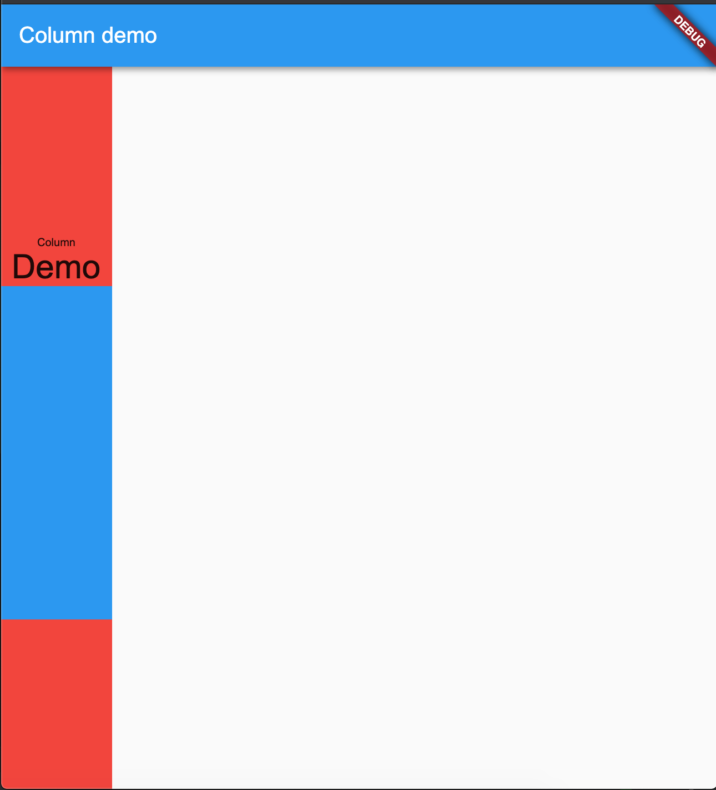 

Колонка имеет идентичный функционал с Row

### Stack
Позиционирует дочерние виджеты друг над другом

```dart
  Widget stackDemo({
    AlignmentGeometry alignment,
    TextDirection textDirection,
    Overflow overflow,
    StackFit fit,
  }) {
    return Stack(
      textDirection: textDirection,
      alignment: alignment,
      overflow: overflow,
      fit: fit,
      children: <Widget>[
        Container(
          width: 300,
          height: 300,
          color: Colors.redAccent,
        ),
        Container(
          width: 200,
          height: 200,
          color: Colors.greenAccent,
        ),
        Container(
          width: 100,
          height: 100,
          color: Colors.blueAccent,
        ),
      ],
    );
  }
```

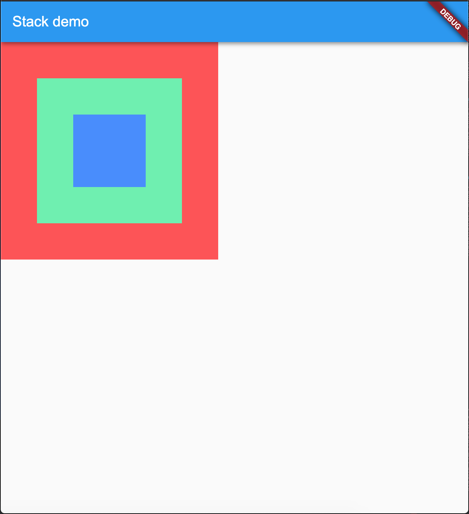 

Имеет следующие параметры

- textDirection - позиционирование текста внутри стека слева или справа. Аналогично как у row или column

- alignment - выравнивание дочерних элементов по сторонам родительского виджета. Работает аналогично виджету Align

- overflow - обрезание контента, выходящего за пределы стека.
    - clip - контент обрезается
    
    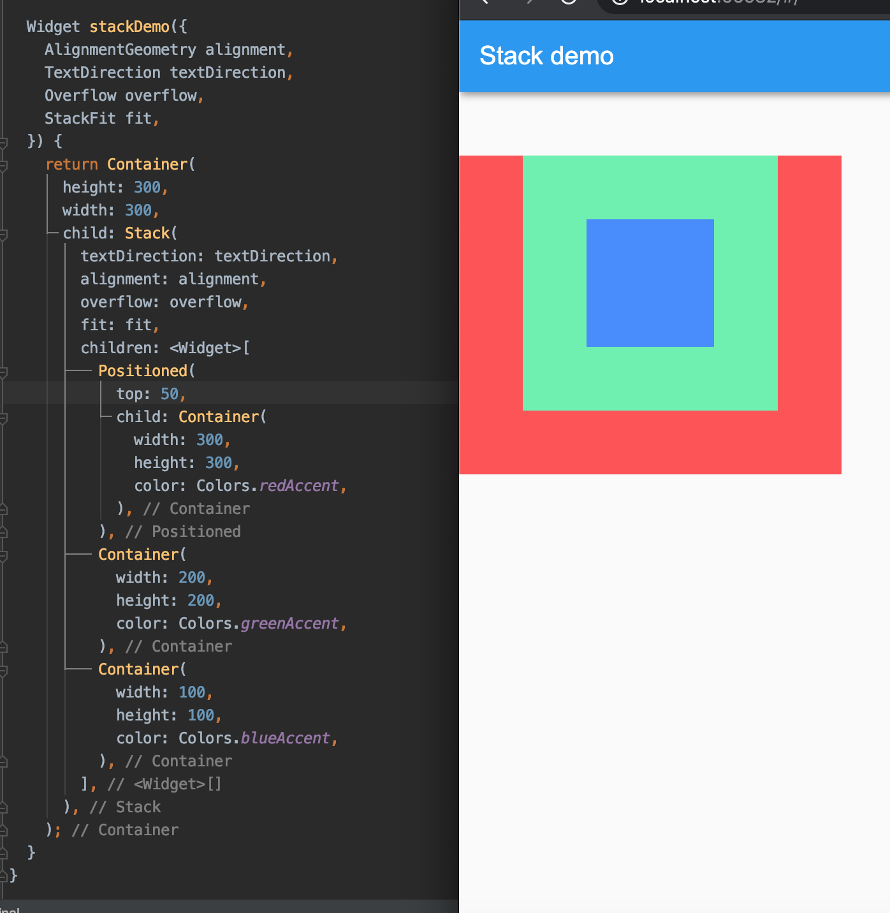 
    
    - clip - контент обрезается
        
    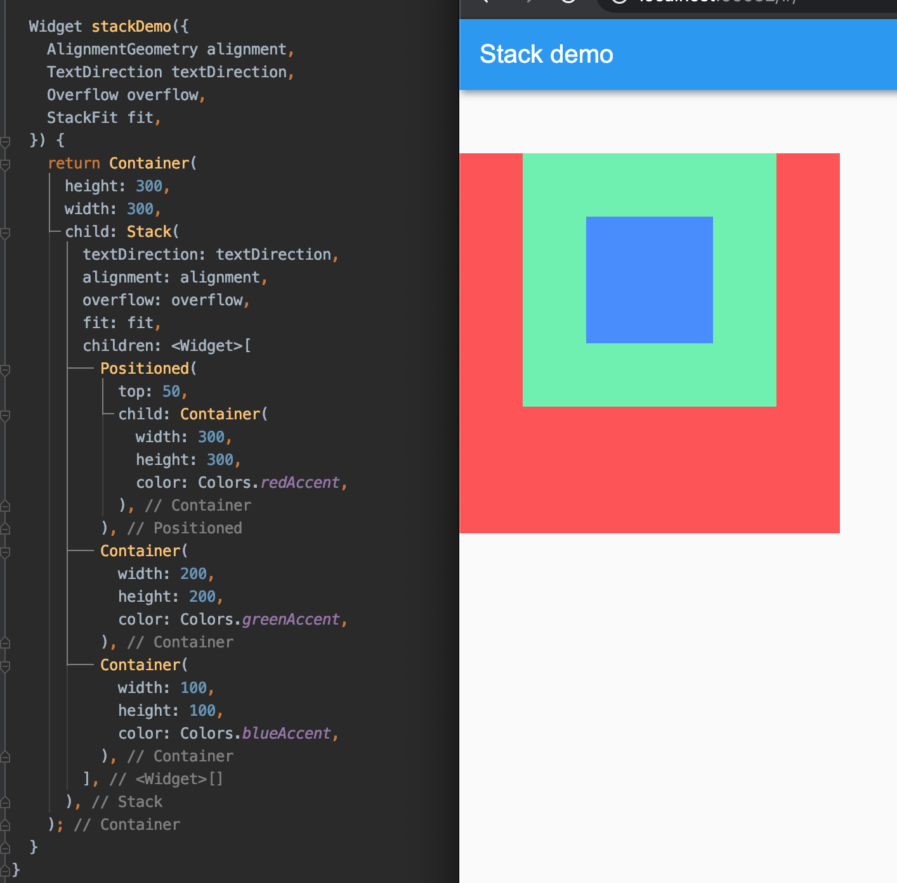 

- fit - растягивание размеров дочерних элементов стека до родительского виджета или до размеров содержимого
    - loose - растягивание до размеров содержимого
        
    
### SingleChildScrollView
Содержит один дочерний виджет.
Когда дочерние элементы не помещаются на один экран устройства, для их прокрутки необходимо использовать SingleChildScrollView.

```dart
  Widget singleChildScrollView({
    Axis scrollDirection,
    EdgeInsetsGeometry padding,
    ScrollController controller,
    bool reverse,
    bool primary,
    ScrollPhysics physics,
    DragStartBehavior dragStartBehavior,
  }) {
    return SingleChildScrollView(
      scrollDirection: scrollDirection,
      padding: padding,
      controller: controller,
      reverse: reverse,
      primary: primary,
      physics: physics,
      dragStartBehavior: dragStartBehavior,
      child: Column(
        children: <Widget>[
          Container(
            width: 200,
            height: 200,
            color: Colors.blueAccent,
          ),
          SizedBox(
            height: 50,
          ),
          Container(
            width: 200,
            height: 200,
            color: Colors.blueAccent,
          ),
          SizedBox(
            height: 50,
          ),
          Container(
            width: 200,
            height: 200,
            color: Colors.blueAccent,
          ),
          SizedBox(
            height: 50,
          ),
          Container(
            width: 200,
            height: 200,
            color: Colors.blueAccent,
          ),
          SizedBox(
            height: 50,
          ),
        ],
      ),
    );
  }
```
Имеет следующие параметры
- scrollDirection - направление скролла
    - Axis.vertical - по вертикали
    
     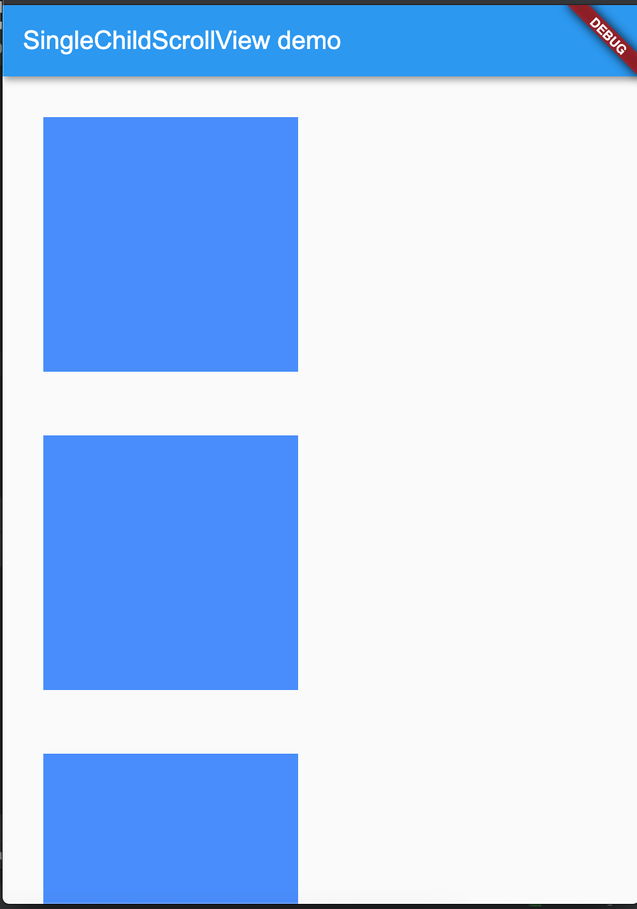 
    
    - Axis.horizontal - по горизонтали
    
      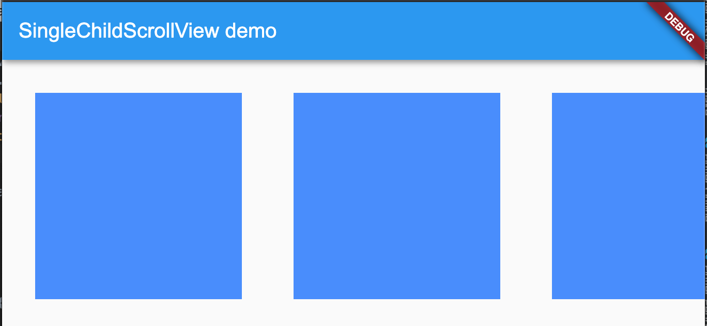 
    
- padding - паддинг

  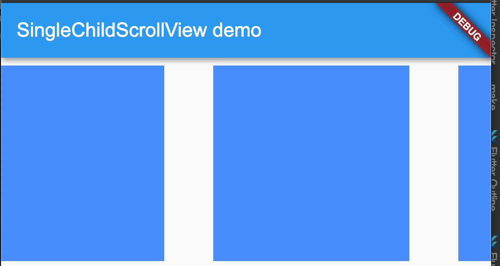 

- scrollPhysics - физика скролла

   - AlwaysScrollablePhysics - скролл всегда работает
 
   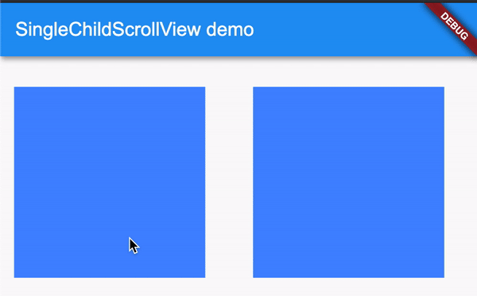 

   - NeverScrollablePhysics - скролл не работает
 
   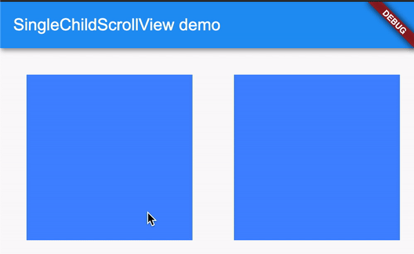 

   - BouncingScrollablePhysics - прокрутка как на ios
 
    
   
   - ClampingScrollablePhysics - прокрутка как на android
 
   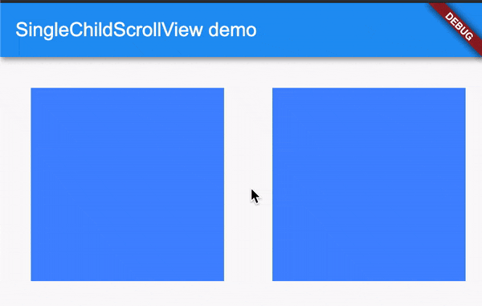 
   
   - FixedExtentScrollPhysics - не работает с SingleChildScrollView
   
   - PageScrollPhysics - не работает с SingleChildScrollView

- reverse - смена направления скролла по текущей оси

- primary - Связывает ScrollController с поддеревом. Когда ScrollView имеет ScrollView.primary, установленный в
значение true, и ему не задан явный ScrollController, ScrollView использует для поиска ScrollController,
связанного с его поддеревом. Этот механизм может использоваться для обеспечения поведения по умолчанию для 
дочерних виджетов прокрутки. Например, Scaffold использует этот механизм для реализации жеста прокрутки вверх в iOS.

- dragStartBehavior - Определяет способ обработки прокрутки.
Если установлено значение DragStartBehavior.start, прокрутка начнется после обнаружения жеста.
Если установлено значение DragStartBehavior.down, оно начнется при первом обнаружении жеста.
В общем, установка этого значения в DragStartBehavior.start сделает анимацию перетаскивания более плавной,
а установка в DragStartBehavior.down сделает поведение перетаскивания более реактивным.
По умолчанию поведение начала перетаскивания - DragStartBehavior.start.

### ListView
Список. В отличии от SingleChildScrollView, содержит упорядоченное множество дочерних виджетов.
Имеет две ориентации прокрутки, физику прокрутки. Имеет встроенный динамический генератор списка.

```dart

Widget staticListViewDemo({
    ScrollPhysics scrollPhysics,
    bool isReverse,
    DragStartBehavior dragStartBehavior,
    ScrollDirection scrollDirection,
    bool isPrimary,
    ScrollController scrollController,
    bool addRepaintBoundaries,
    EdgeInsetsGeometry padding,
    bool addAutomaticKeepAlives,
    bool addSemanticIndexes,
    double cacheExtent,
    double itemExtent,
    ScrollViewKeyboardDismissBehavior keyboardDismissBehavior,
    int semanticChildCount,
    bool shrinkWrap,
  }) {
    return ListView(
      physics: scrollPhysics,
      reverse: isReverse,
      dragStartBehavior: dragStartBehavior,
      scrollDirection: Axis.vertical,
      primary: false,
      controller: controller,
      addRepaintBoundaries: addRepaintBoundaries,
      padding: padding,
      addAutomaticKeepAlives: addAutomaticKeepAlives,
      addSemanticIndexes: addSemanticIndexes,
      semanticChildCount: semanticChildCount,
      cacheExtent: cacheExtent,
      itemExtent: itemExtent,
      keyboardDismissBehavior: keyboardDismissBehavior,
      shrinkWrap: shrinkWrap,
      children: <Widget>[
        for (int i = 0; i < 100; i++)
          Padding(
            padding: const EdgeInsets.all(8.0),
            child: Container(
              height: 50,
              width: 50,
              color: Colors.blueAccent,
            ),
          ),
      ],
    );
  }
```

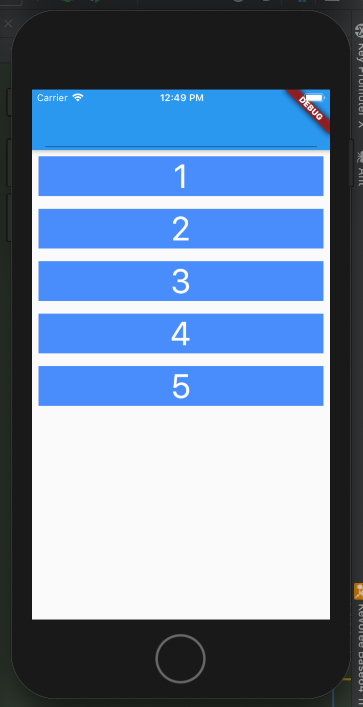

Параметры:
- isReverse - прокрутка в обратную сторону
- scrollDirection - направление скролла.
    - vertical - вертикальный скролл
    - horizontal - горизонтальный скролл
- addRepaintBoundaries - //todo найти материал
- addAutomaticKeepAlives - //todo найти материал
- addSemanticIndexes - //todo найти материал
- semanticChildCount - //todo найти материалы
- itemExtent - размер элемента списка по основной оси. По умолчанию определяется размером дочернего виджета.

```dart
  Widget itemExtentTest(){
    return ListView(
      itemExtent: 50,
      children: <Widget>[
        Container(width: 100, height: 100, color: Colors.blue,),
      ],
    );
  }
```

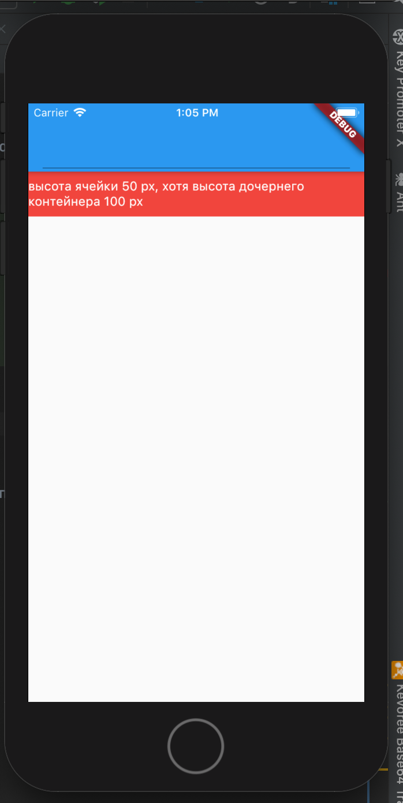

- cacheExtent - положение кэша слева и справа от текущего положения прокрутки. Чем больше значение, тем больше итемов
списка сохраняется в памяти.

- keyboardDismissBehavior - способ закрытия клавиатуры. 
    - drag - клавиатура автоматически закрывается при скролле 
    - manual - клавиатуру необходимо закрывать вручную 
    
- shrinkWrap - сжимает размер ListView до размеров содержимого


### Динамическая генерация списка

#### builder
Помимо статичных элементов, ListView может генерировать элементы в ходе работы программы. 
Для этого используется builder.

```dart
  Widget dynamicListViewDemo() {
    return ListView.builder(
        itemCount: 10,
        itemBuilder: (context, index) {
          return Text('hello $index');
        });
  }
```
На вход получает дополнительный параметр itemCount.
Он необходим для ограничения списка по количеству дочерних элементов.
Если этот параметр не указан, список будет генерироваться бесконечно.

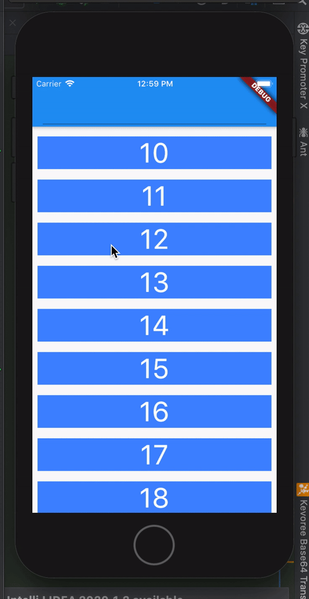

#### custom

Конструктор ListView.custom принимает SliverChildDelegate, который предоставляет возможность настраивать дополнительные
аспекты дочерней модели

```dart
 Widget customListView() {
    return ListView.custom(
      childrenDelegate: SliverChildListDelegate(
        List.generate(
          100,
          (index) {
            return Container(
              padding: EdgeInsets.all(20.0),
              child: Center(
                child: ListTile(
                  leading: const Icon(Icons.account_circle,
                      size: 40.0, color: Colors.white30),
                  title: Text('MainItem $index'),
                  subtitle: Text('subtitle'),
                ),
              ),
              color: Colors.green[400],
              margin: EdgeInsets.all(1.0),
            );
          },
        ),

        /// теория
        /// Не удалять виджет после того, как он вышел за пределы экрана.
        /// по умолчанию включен. Можно отключить, если нет необходимости поддерживать
        /// жизненный цикл виджета, когда он скрывается за пределами экрана
        /// todo найти рабочий пример
        addAutomaticKeepAlives: true,

        /// https://api.flutter.dev/flutter/widgets/SliverChildListDelegate/addRepaintBoundaries.html
        /// тоже про перерисовку виджета, но практического примера не нашел
        /// todo найти рабочий пример
        addRepaintBoundaries: false,

        /// https://api.flutter.dev/flutter/widgets/SliverChildListDelegate/addSemanticIndexes.html
        /// todo найти пример по семантическим индексам
        addSemanticIndexes: true,

        ///todo найти нормальный сэмпл
        semanticIndexCallback: (widget, index) {},

        ///todo найти нормальный сэмпл
        semanticIndexOffset: 0,
      ),
    );
  }
```

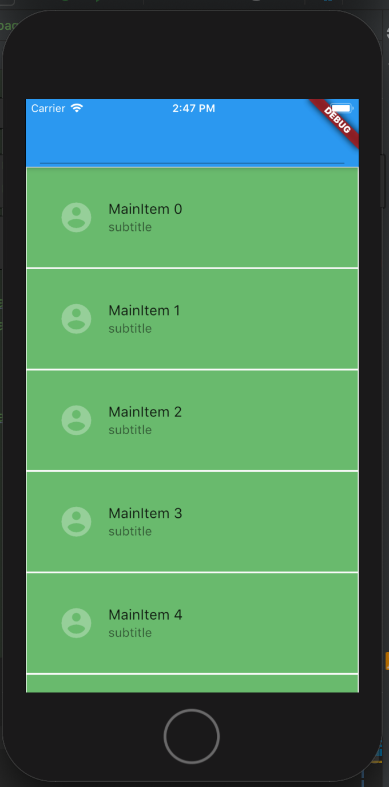

#### separated
Создает список с разделителем. Вид разделителя можно сконфигурировать в билдере.

```dart
 Widget separatedListView() {
    return ListView.separated(
      itemBuilder: (BuildContext context, int index) {
        return buildItem(index);
      },
      separatorBuilder: (BuildContext context, int index) {
        return Container(
          height: 20,
          color: Colors.lime,
        );
      }, itemCount: 10,
    );
  }
```

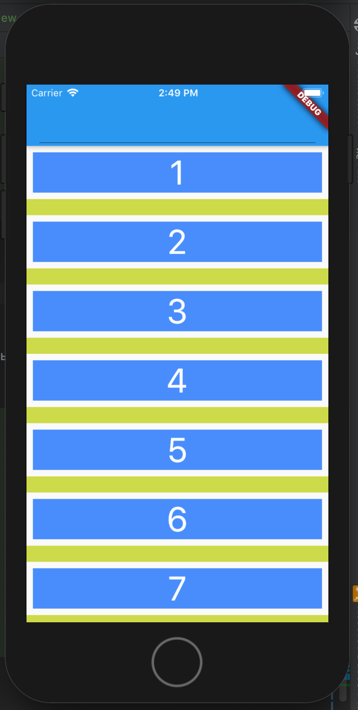

### PageView
Создает список страничек. Прокрутка осуществляется слева на право и наоборот.

```dart
  Widget pageViewDemo() {
    return PageView.builder(
      pageSnapping: true,
      itemCount: 3,
      onPageChanged: (index) {
        print("hi $index");
      },
      itemBuilder: (context, index) {
        return Padding(
          padding: const EdgeInsets.all(8.0),
          child: Container(
            decoration: BoxDecoration(
              color: Colors.amber,
              borderRadius: BorderRadius.all(
                Radius.circular(8),
              ),
            ),
            width: 200,
            height: 200,
            child: Center(
              child: Text(
                "page $index",
                style: TextStyle(
                  color: Colors.black,
                ),
              ),
            ),
          ),
        );
      },
    );
  }
```
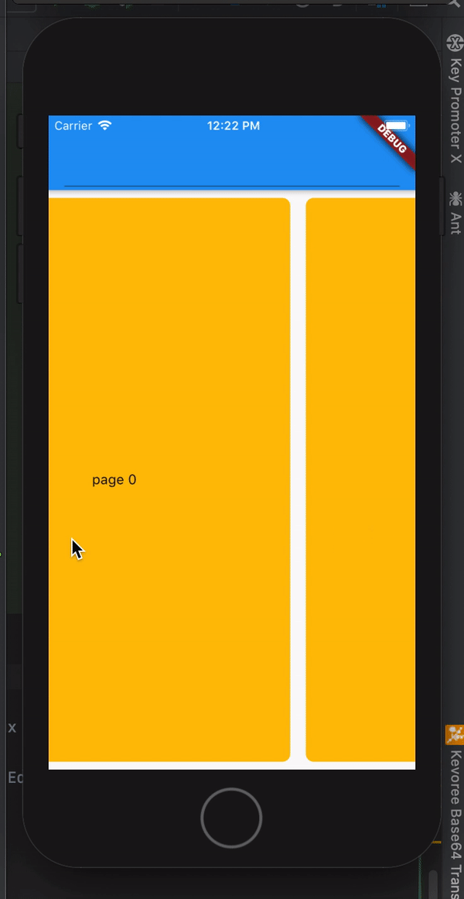

В целом имеет схожий функционал с ListView, за исключением следующих параметров

- pageSnapping - остановка прокрутки при открытии новой странички. Если false прокрутка будет происходить без остановки
- allowImplicitScrolling - todo найти материал
- onPageChanged - коллбэк, срабатывающий на изменение страницы

## Дополнительные материалы
>- https://medium.com/jlouage/flutter-row-column-cheat-sheet-78c38d242041

## Примеры
[layout_example](../../../example/lib/layout)