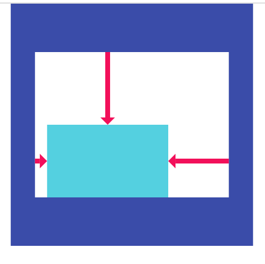
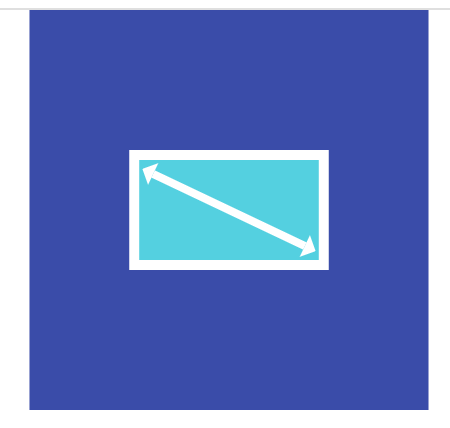
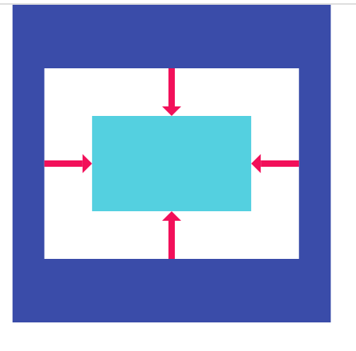
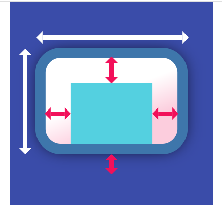
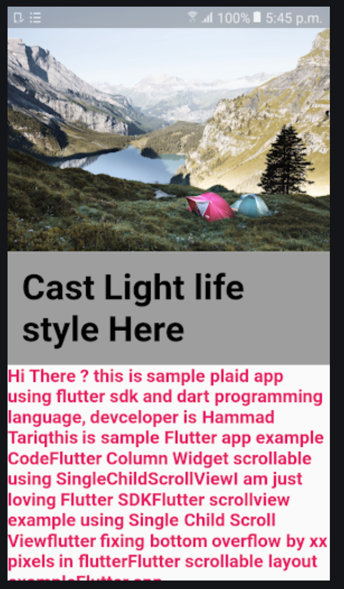
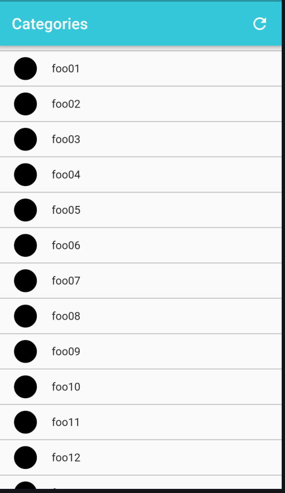
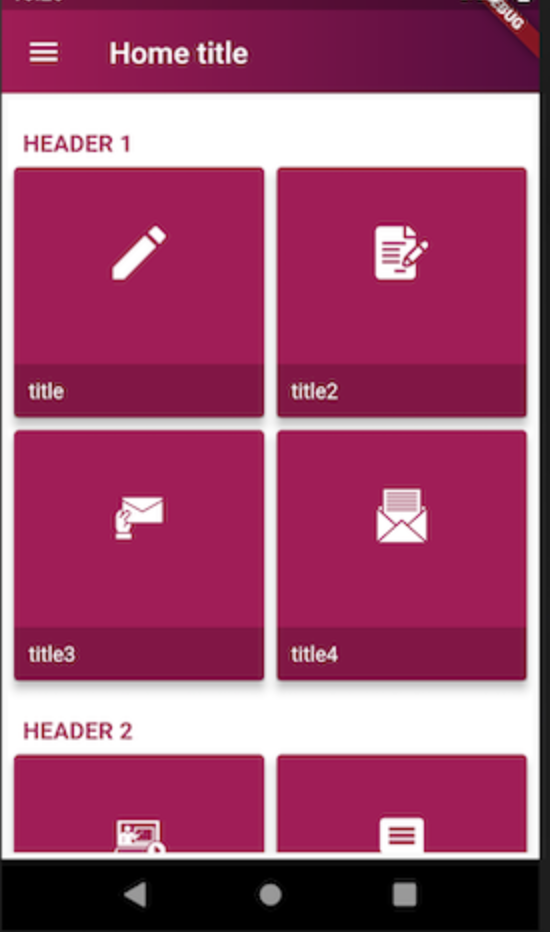
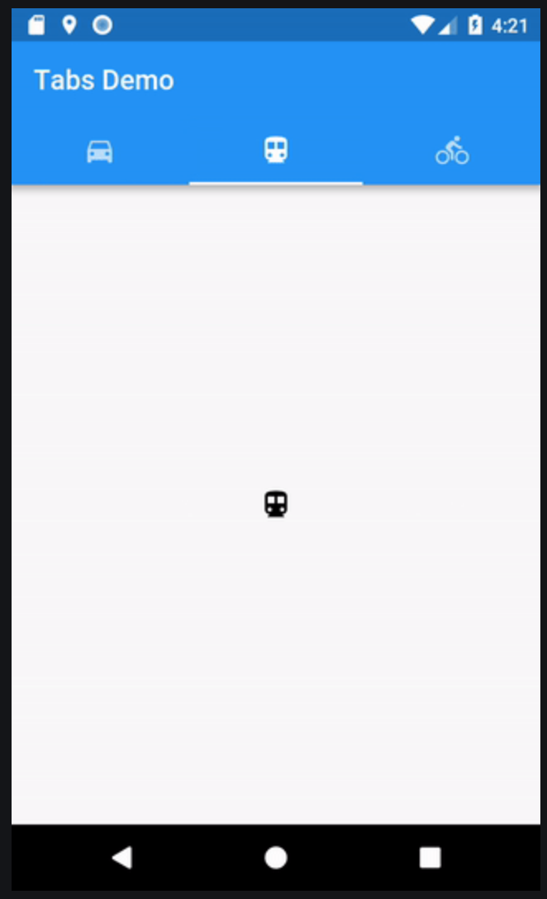

## Оглавление
[Назад к ui](../ui.md)

[containers](containers/containers.md) - про контейнеры

[scrolling](scrolling/scrolling.md) - виджеты с прокруткой

## Ключевые ресурсы
>- https://flutter.dev/docs/development/ui/widgets/layout (EN) - про разметку
>- https://flutter.dev/docs/development/ui/widgets/scrolling (EN) - про ScrollableWidget

# Layout
В этом разделе собраны материалы по виджетам разметки во Flutter.

## О разметке
Одним из видов виджетов являются виджеты разметки. С помощью лэйаутов 
настраивается положение виджетов на экране.

## Виды

## Containers
Виджеты, которые хранят другие виджеты и настраивают их положение на экране
### SingleChildLayout
Виджеты, которые позиционируют одиночные элементы.

- Align - Виджет, который выравнивает дочерний элемент внутри себя и,
при необходимости, изменяет размеры в зависимости от размера дочернего элемента.

- AspectRatio - Виджет, который пытается определить размер дочернего элемента в соответствии с определенным соотношением сторон.

- Center - Виджет, который центрирует дочерний виджет внутри себя.

- Container - Виджет, который объединяет обычные виджеты рисования, позиционирования и размеров.

[Более подробная информация про остальные SingleChildLayout](https://flutter.dev/docs/development/ui/widgets/layout)

### MultiChildLayout
Виджеты, которые позиционируют несколько эдементов внутри себя

- Column - Позиционирует виджеты по вертикали.

- Row - Позиционирует виджеты по горизонтали.

- Stack - Позиционирует виджеты друг над другом

## Scrollable
Прокручиваемые виджеты. Могут содержать как один, так и несколько дочерних элементов.

- SingleChildScrollView - прокручиваемый лэйаут, который хранит одного потомка. Подходит для отображения
большого количества виджетов, которые не помещаются на одном экране.

- ListView - прокручиваемый список. Содержит список дочерних виджетов. Имеет вертикальное и горизонтальное направление,
физику скролла.

- GridView - прокручиваемый список в виде сетки. Имеет схожий функционал с ListView

- TabView - Прокручиваемые табы на экране.

[Более подробная информация про остальные ScrollableWidgets](https://flutter.dev/docs/development/ui/widgets/scrolling)