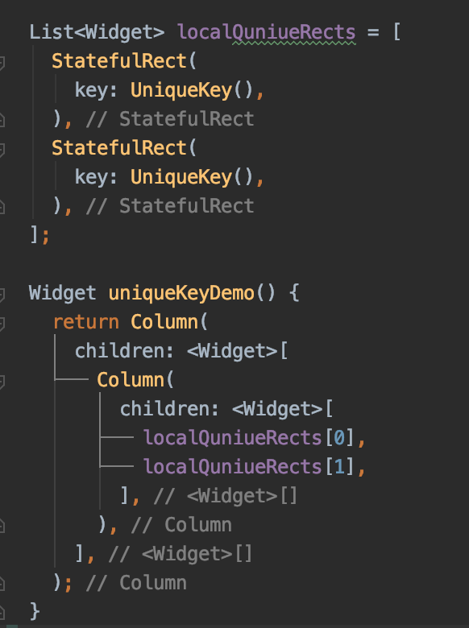

[На главную](../../flutter.md)

# Key
В этом разделе собраны материалы про Key

## Ключевые ресурсы
>- https://www.youtube.com/watch?v=kn0EOS-ZiIc (EN) - видео-инструкция по ключам
>- https://api.flutter.dev/flutter/foundation/Key-class.html (EN) - документация

## О Key
Ключ это идентификатор виджета в дереве элементов. Основное назначение ключа 
состоит в том, чтобы идентифицировать виджет в дереве элементов. 

### Как работает key
Во время обновления Elements Tree происходит проверка `runtimeType` и `key` виджета. Если
они одинаковые, то перестройки виджета не происходит, обновляется только содержание виджета.

Картинка получена с сайта https://habr.com/ru/post/446050/

Но это правило работает только для виджетов. Если информация о виджете хранится в состоянии State 
у StatefullWidget, то визуального обновления не произойдет.

Картинка получена с сайта https://habr.com/ru/post/446050/

В таком случае в StatefulWidget необходимо поместить ключ. Когда фреймворк увидит, что
в текущий элемент попал виджет с другим ключом, он обновит состояние этого виджета

## Виды ключей

### Key
Хранит текстовое значение. Для обновления, виджеты, находящиеся внутри одного родителя, должны иметь уникальные ключи.

### Local Key
Когда необходимо сделать виджет уникальным в рамках родительского виджета используется LocalKey.

Если хотя бы один ключ будет повторяться в пределах одного родительского виджета, обновление виджетов не произойдет.

Так не сработает

Но т.к LocalKey работает только в пределах родительского элемента в ElementsTree, то виджеты с одинаковыми ключами,
расположенные в различных узлах дерева обновляется успешно.

Так сработает.

У локального ключа есть 3 расширения:
>- `ValueKey(T value)` - для самоидентификации использует объект любого типа. Пример использования описан выше
>- `ObjectKey(object value)` - для самоидентификации использует тип object.

>- `UniqueKey()` - когда нет необходимости идентифицировать ключ объектом, можно воспользоваться уникальным ключом. 

### Global Key
Глобальный ключ делает элемент уникальным по всему дереву виджетов.

Глобальный ключ может использоваться для получения информации о виджете, который стоит ниже по иерархии, или находится в другом узле.[Пример](../../../example/lib/keys/global_key_demo.dart)

## Дополнительные материалы
>- https://medium.com/@ayushpguptaapg/using-keys-in-flutter-1c5fb586b2a5 (EN) - использование ключей
>- https://habr.com/ru/post/446050/ (RU) - перевод видео инструкции про ключи
>
## Примеры
[пример использования ключей](../../../example/lib/keys)