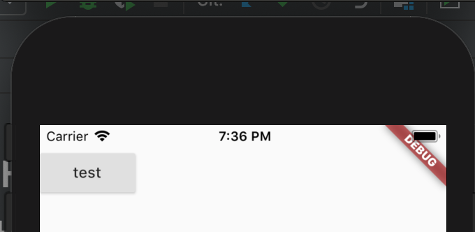
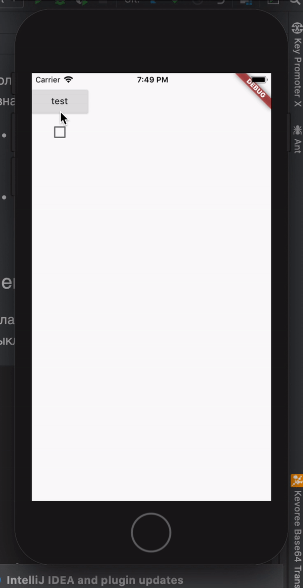
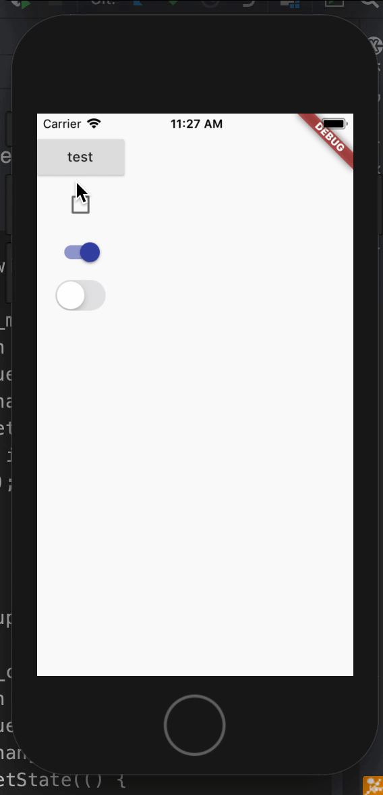

# Кнопки и элементы выбора

В этом разделе собраны материалы про кнопки, создание своих кнопок
и элементов выбора, таких как чекбоксы, радиобаттоны, свитчеры и тд.

## Ключевые ресурсы
>- https://flutter.dev/docs/development/ui/widgets/cupertino (EN) - офф. документация про Cupertino виджеты
>- https://flutter.dev/docs/development/ui/widgets/material (EN) - офф. документация про Material виджеты
>- https://flutter.dev/docs/cookbook/gestures/handling-taps(EN) - кукбук по отлавливанию событий

## Оглавление
>- [назад к sdk_components](../sdk_components.md)

### Кнопка
Кнопка это виджет, по нажатию на которую срабатывает какое-нибудь действие.

```dart
  Widget _buttonDemo(BuildContext context) {
    return RaisedButton(
      onPressed: () {
        print("hello");
      },
      child: Text("test"),
    );
  }
```



Кнопки имеют различные вариации для MaterialDesign и Cupertino, но у всех кнопок
похожий базовый функционал - дочерний виджет и коллбэк, срабатывающий по нажатию.

Более подробно с видами кнопок можно ознакомиться в документации

- Material виджеты - https://flutter.dev/docs/development/ui/widgets/material
- Сupertino виджеты - https://flutter.dev/docs/development/ui/widgets/cupertino

### Checkbox
Флажок, имеет два состояния - включен/выключен. Не имеет аналога  Cupertino.

```dart
  var isActive = false;

  Widget _checkBoxDemo() {
    return Checkbox(
      value: isActive,
      onChanged: (_) {
        setState(() {
          isActive = !isActive;
        });
      },
    );
  }
```



Более подробно ознакомиться с чекбоксом можно в [офф. документации](https://api.flutter.dev/flutter/material/Checkbox-class.html)

### RadioButton

Схожая с флажком кнопка, круглой формы - https://api.flutter.dev/flutter/material/Radio-class.html

### Switcher

Переключатели имеют схожий функционал с Checkbox

```dart
  var isSwitchActive = false;

  Widget _materialSwitchDemo() {
    return Switch(
      value: isSwitchActive,
      onChanged: (currentValue) {
        setState(() {
          isSwitchActive = !isSwitchActive;
        });
      },
    );
  }

  var isCupertinoSwitchActive = false;

  Widget _cupertinoSwitchDemo() {
    return CupertinoSwitch(
      value: isCupertinoSwitchActive,
      onChanged: (isActive) {
        setState(() {
          isCupertinoSwitchActive = !isCupertinoSwitchActive;
        });
      },
    );
  }
```


### Кастомные элементы управления
Виджеты, описанные выше похожи между собой. По нажатию происходит действие. Иногда требуется разработать кастомный 
виджет управления. Для этого подходит GestureDetector. Он отслеживает пользовательские события. 
См. [статью GestureDetector](../interaction/gesture_detector/gesture_detector.md)

### Дополнительные материалы
>- https://medium.com/suryadevsingh24032000/buttons-clickable-widgets-in-flutter-2b2167fcfa23 (EN) - подробный гайд по кнопкам
>

### Пример
[buttons](../../../../example/lib/widgets/buttons/button_demo.dart)
[custom_button](../../../../example/lib/widgets/interaction/gesture_detector/gesture_detector_demo.dart)


