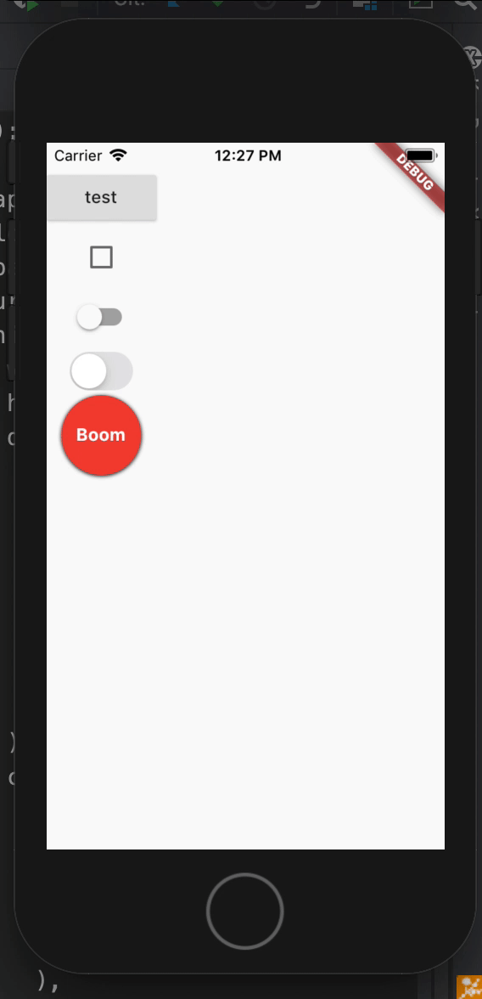

# GestureDetector
todo доделать статью

В этом разделе собраны материалы про GestureDetector

## Ключевые ресурсы
>- todo найти ресурсы

## Оглавление
>- [назад к sdk_components](../../sdk_components.md)

## Про GestureDetector

- Пример 1 

```dart
  Widget _gestureDetectorDemo(VoidCallback onTap) {
    return GestureDetector(
      onTapDown: (_) {
        setState(() {
          buttonOpacity = .5;
        });
      },
      onTapUp: (_) {
        setState(() {
          buttonOpacity = 1.0;
        });
      },
      onTapCancel: () {
        setState(() {
          buttonOpacity = 1.0;
        });
      },
      onTap: onTap,
      child: AnimatedOpacity(
        opacity: buttonOpacity,
        duration: Duration(milliseconds: 200),
        child: Container(
          width: 64,
          height: 64,
          decoration: BoxDecoration(
            shape: BoxShape.circle,
            color: buttonColor,
            boxShadow: [
              BoxShadow(
                blurRadius: 2,
                offset: Offset(0.0, .7),
              ),
            ],
          ),
          child: Center(
              child: Text(
            "Boom",
            style: TextStyle(
              color: Colors.white,
              fontWeight: FontWeight.bold,
            ),
          )),
        ),
      ),
    );
  }
```



### Дополнительные материалы

### Пример