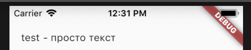
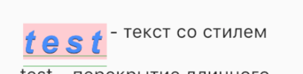
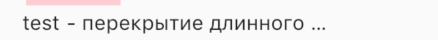
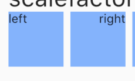
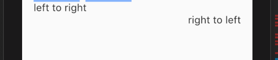
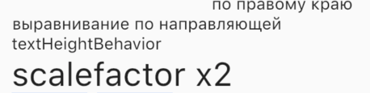
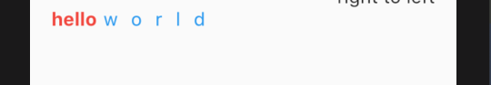

# Текстовые виджеты

В этом разделе собраны материалы про текстовые виджеты, шрифты

## Ключевые ресурсы
>- https://api.flutter.dev/flutter/widgets/Text-class.html (EN) - про Text
>- https://api.flutter.dev/flutter/widgets/RichText-class.html (EN) - про RichText

## Оглавление
>- [назад к sdk_components](../sdk_components.md)

### Text
Поле с текстом. Нельзя вводить символы. Можно настраивать стили текста.

```dart
Widget _text(
    String descr, {
    double width,
    TextStyle style,
    TextOverflow overflow,
    int maxLines,
    Locale locale,
    bool softWrap,
    String semanticLabel,
    StrutStyle strutStyle,
    TextAlign textAlign,
    TextDirection textDirection,
    TextHeightBehavior textHeightBehavior,
    double textScaleFactor,
    TextWidthBasis textWidthBasis,
  }) {
    return Row(
      children: <Widget>[
        Text(
          "test",
          overflow: overflow,
          maxLines: maxLines,
          locale: locale,
          softWrap: softWrap,
          semanticsLabel: semanticLabel,
          strutStyle: strutStyle,
          textAlign: textAlign,
          textDirection: textDirection,
          textHeightBehavior: textHeightBehavior,
          textScaleFactor: textScaleFactor,
          textWidthBasis: textWidthBasis,
          style: style,
        ),
        Flexible(
          child: Container(
            width: width ?? 500,
            child: Text(
              " - $descr",
              textAlign: textAlign,
              overflow: overflow,
            ),
          ),
        ),
      ],
    );
  }
```

```dart
 _text("просто текст",),
```



### Параметры

- style - стиль текста 
    - color - цвет. должен быть null если задан foreground
    
    - fontSize - размер текста 
    - background - задний фон. 
    - height - множитель высоты строки при текущем размере
    - letterSpacing - расстояние между символами
    - wordSpacing - расстояние между словами
    - fontWeight - стиль толщины текста
    - fontFamily - семейство шрифтов. можно подключать кастомные шрифты. Cм.ниже todo сделать пример
    - fontStyle - стиль текста. подчеркнутый или нормальный
    - fontFamilyFallback - найти матеирал
    - decoration - подчеркивание текста. снизу, по центру, сверху. Так-же можно выбрать массив декораций.
    - decorationStyle - стиль подчеркивание. Двойная линия, волнистая линия, курсив, точки, сплошная.
    - decorationColor - цвет подчеркивания
    - decorationThickness - толщина подчеркивания
    - shadows - массив теней
    - fontFeatures - фичи текста. подробно описано [здесь](https://medium.com/flutter-community/font-features-in-flutter-320222fc171d)
    - textBaseline - выравнивание текста по базовым линиям.  todo сделать пример
    - locale - todo найти рабочий пример
    - debugLabel - информация для отладки
    - package - todo найти рабочий пример
```dart
Column(
                crossAxisAlignment: CrossAxisAlignment.start,
                children: <Widget>[
                  _text(
                    "просто текст",
                  ),
                  _text(
                    "текст со стилем",
                    style: TextStyle(
                      color: Colors.blueAccent,
                      fontSize: 25,
                      background: Paint()..color = Colors.red[100],
//                  backgroundColor: Colors.blueGrey,
//                foreground: Paint()..color = Colors.green[100],
                      height: 2,
                      letterSpacing: 5,
                      fontWeight: FontWeight.bold,
                      wordSpacing: 2,
                      /// https://flutter.dev/docs/cookbook/design/fonts
                      fontFamily: "Arial",

                      ///todo найти матеирал по fontFamilyFallback
                      fontFamilyFallback: ["test"],
                      fontStyle: FontStyle.italic,
                      decorationStyle: TextDecorationStyle.solid,
                      decoration: TextDecoration.overline,
                      decorationColor: Colors.green,
                      decorationThickness: 2,
                      inherit: true,
                      shadows: [
                        Shadow(
                          color: Colors.black,
                          offset: Offset(0, 0.5),
                        ),
                      ],
                      textBaseline: TextBaseline.ideographic,
                      locale: Locale("ru"),
                      debugLabel: "debug test",
                    ),
                  ),
```



- overflow - перекрытие текста при выходе за границы родительского виджета. 
    - elipsis - перекрытие точками
    - fade - перекрытие прозрачностью
    - visible - текст не перекрывается
    - clip - перекрытие обрезанием



- maxlines - максимальное количество линий в строке. если текст превышает количество линий, происходит обрезка текста

- locale - локализация текста. сработало только на уровне MaterialApp, todo найти как менять локализацию конкретно у строки

- softWrap - Должен ли текст разрываться при мягких переносах строк. Если false, символы в тексте будут расположены так,
как если бы было неограниченное горизонтальное пространство. todo найти рабочий пример

- semanticsLabel - todo сделать семантику

- strutStyle - минимальная высота строки в текстовом виджете.
подробнее [офф. документация](https://api.flutter.dev/flutter/painting/StrutStyle-class.html) и
[туториал на stackoverflow](https://stackoverflow.com/questions/56799068/what-is-the-strutstyle-in-the-flutter-text-widget)

- textAlign - выравнивание текста по горизонтали

```dart 
Row(
children: <Widget>[
  Container(
    width: 64,
    height: 64,
    color: Colors.blueAccent[100],
    child: Text(
      "left",
      textAlign: TextAlign.left,
    ),
  ),
  SizedBox(width: 8),
  Container(
    width: 64,
    height: 64,
    color: Colors.blueAccent[100],
    child: Text(
      "right",
      textAlign: TextAlign.right,
    ),
  ),
  SizedBox(width: 8),
  Container(
    width: 64,
    height: 64,
    color: Colors.blueAccent[100],
  ),
  SizedBox(width: 8),
],
),
```



- textDirection - Направление текста. Слева на право или наоборот.



- textHeightBehavior - todo найти материал

- textScaleFactor - маштабирование текста



- textWidthBasis - todo найти материал

### RichText
Когда в одном тексте встречаются несколько стилей удобно использовать RichText

```dart
     RichText(
                    text: TextSpan(
                      children: [
                        TextSpan(
                          text: "hello",
                          style: TextStyle(
                            color: Colors.red,
                            fontWeight: FontWeight.bold,
                          ),
                        ),
                        TextSpan(
                          text: "world",
                          style: TextStyle(
                            color: Colors.blue,
                            letterSpacing: 10,
                          ),
                        ),
                      ],
                    ),
                  ),
```



### Кастомные шрифты
Помимо стандартных шрифтов, в проект можно подключать свои шрифты. [Официальная инструкция](https://flutter.dev/docs/cookbook/design/fonts)

### Дополнительные материалы
>- https://medium.com/flutter-community/font-features-in-flutter-320222fc171d (EN) - про FontFeature
>- https://flutter.dev/docs/development/accessibility-and-localization/internationalization#setting-up (EN) - офф. гайд по локалям
>- https://github.com/flutter/flutter/blob/master/packages/flutter_localizations/lib/src/l10n/README.md (EN) - офф. репо локалей   
>- https://api.flutter.dev/flutter/painting/StrutStyle-class.html (EN) - про StrutStyle
>- https://flutter.dev/docs/cookbook/design/fonts (EN) - про кастомные шрифты

### Пример
[text](../../../../example/lib/widgets/text_widgets/text_demo.dart)
