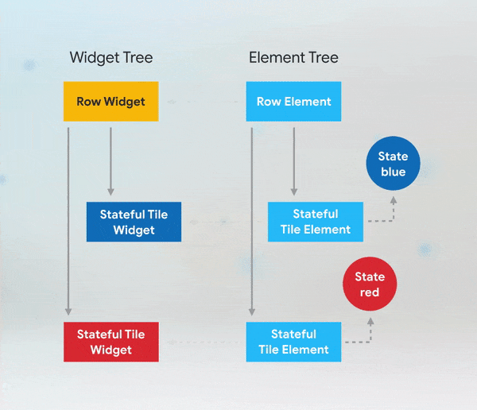
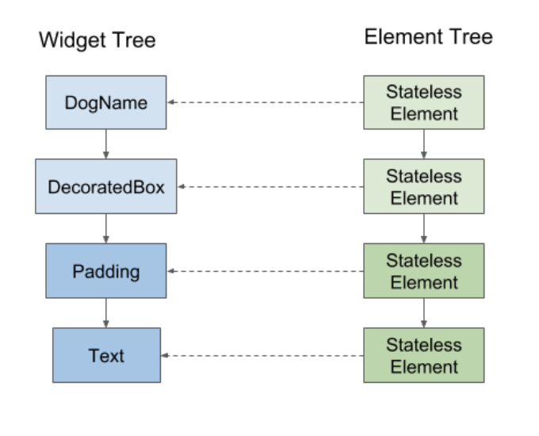
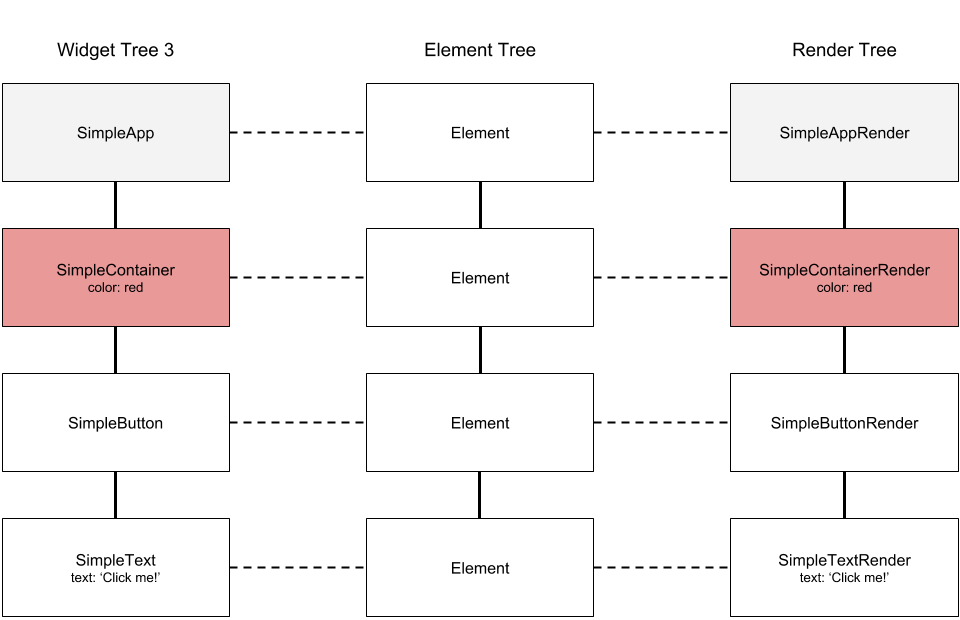

[На главную](../../flutter.md)

# Widget
В этом разделе собраны материалы про виджеты

## Оглавление
[key](key/key.md) - про ключи

[sdk_component](sdk_components/sdk_components.md) - про стандартные компоненты flutter sdk,
на которых строится пользовательский интерфейс(кнопки, картинки, чекбоксы, свитчеры, свайперы и тд)

## Ключевые ресурсы
>- https://flutter.dev/docs/development/ui/widgets-intro (EN) - Офф. урок про виджеты
>- https://flutter.dev/docs/development/ui/widgets (EN) - стандартный каталог виджетов

## О Виджетах

UI приложения, написанного на Flutter состоит из виджетов. Виджет это часть пользовательского интерфейса приложения.
Например виджетом являются кнопка, текст, картинка, экран главного меню, боттомшит. 

Основная идея заключается в том, что вы создаете свой пользовательский интерфейс из виджетов. 
Виджеты описывают, как должен выглядеть их вид, учитывая их текущую конфигурацию и состояние.
Когда состояние виджета изменяется, виджет перестраивает свое описание, которое отличается от предыдущего описания,
чтобы определить минимальные изменения, необходимые в дереве рендера для перехода из одного состояния в другое.

### Виды виджетов

#### StatelessWidget
Когда необходимо реализовать виджет со статическими данными, которые не будут меняться в ходе работы приложения,
удобно использовать StatelessWidget. Этот тип виджетов зависит от данных, полученных от родительского виджета.
Если внутри StatelessWidget'a происходит изменение данных, он не может реагировать на изменение и обновлять UI.
Типичный пример использования StatelessWidget - однотипные элементы ui, кнопки, заголовки, карточки товаров и тд.

```dart
class StatelessDemo extends StatelessWidget {
    int _count = 0;
  
    @override
    Widget build(BuildContext context) {
      return Center(
        child: Column(
          mainAxisAlignment: MainAxisAlignment.center,
          children: <Widget>[
            Text("ClickCount: $_count"),
            OutlineButton(
              child: Text("increment count"),
              onPressed: () {
                _count++;
                print(_count);
              },
            ),
          ],
        ),
      );
    }
  }
```

Обработка графики виджета происходит в методе build. У StatelessWidget'a обработка происходит во время создания объекта один раз.
После этого виджет отображает статичный ui, не реагирующий на изменения данных внутри виджета. Поэтому в данном примере,
несмотря на то, что `_count` увеличивается каждый раз при нажатии на кнопку, эти изменения не отображаются на экране.


При изменении положения StatelessWidget в дереве элементов происходит автоматическое обновление виджета.
Это происходит, потому что переменные, отвечающие за визуализацию виджета хранятся в самом виджете. Во время изменения
структуры дерева элементов происходит проверка каждого элемента. Если внутри элемента разместился новый виджет, то происходит
обновление виджета на экране и он перерисовывается на новой позиции.


Изображение получено с сайта(https://habr.com/ru/post/446050/)

#### BuildContext
BuildContext хранится в Element дерева элементов.
Метод `build(BuildContext context)` принимает параметр `BuildContext`. Он необходим для определения контекста, 
внутри которого расположен виджет. Предоставляет доступ к положению виджета внутри дерева,
размеры экрана, навигатор и пр. Более подробно о BuildContext смотрите в [отдельной статье](buildContext)

#### StatefullWidget, State
StatefulWidget используется когда необходимо визуализировать данные, изменяющиеся с течением времени.

```dart
class StatefulDemo extends StatefulWidget {
  @override
  State<StatefulWidget> createState() {
    return _StatefullDemoState();
  }
}

class _StatefullDemoState extends State<StatefulDemo> {
  int _count = 0;

  @override
  Widget build(BuildContext context) {
    return Center(
      child: Column(
        mainAxisAlignment: MainAxisAlignment.center,
        children: <Widget>[
          Text("ClickCount: $_count"),
          OutlineButton(
            child: Text("increment count"),
            onPressed: () {
              setState(() {
                _count++;
              });
            },
          ),
        ],
      ),
    );
  }
}
```
В отличии от StatelessWidget'a, StatefulWidget имеет состояние `State`. Состояние - это информация, изменяемая в течение времени жизни виджета.
Чтобы обновить состояние необходимо использовать метод `setState`. Когда происходит вызов метода, состояние обновляется,
а те данные которые обновились в теле метода `setState`, перерисовываются на экране. Обновляются 
виджеты, являющиеся корневым или дочерним узлом элемента, в котором происходит обновление состояния. Виджеты, находящиеся
выше по иерархии не обновляются.

```dart
class TopWidget extends StatelessWidget {
  @override
  Widget build(BuildContext context) {
    print("---------------------------");
    print("rebuild TOP widget");
    return Container(
      child: CenterWidget(),
    );
  }
}

class CenterWidget extends StatefulWidget {
  @override
  State<StatefulWidget> createState() {
    return _CenterWidgetState();
  }
}

class _CenterWidgetState extends State<CenterWidget> {
  @override
  Widget build(BuildContext context) {
    print("rebuild CENTER widget");
    return FlatButton(
        onPressed: () {
          setState(() {});
        },
        child: BottomWidget());
  }
}

class BottomWidget extends StatelessWidget {
  @override
  Widget build(BuildContext context) {
    print("rebuild BOTTOM widget");
    print("---------------------------");
    return Container();
  }
}
```

При нажатии на кнопку `FlatButton` из центрального виджета происходит обновление текущей иерархии виджетов.
Обновляется `_CenterWidgetState` и `BottomWidget`. `TopWidget` остается неизменным.


При изменении положения StatefullWidget'а в дереве элементов,визуально обновление виджета не происходит.
Это происходит, потому что переменные, отвечающие за визуализацию виджета хранятся в State виджета.
Более подробно об этом можно прочитать в разделе [ключи](key/key.md)



Изображение получено с сайта(https://habr.com/ru/post/446050/)

#### Передача параметров в состояние
Иногда StatefulWidget может являться дочерним виджетом, параметры которого инициализируются из вне.
В таком случае, чтобы параметр в состояние, необходимо из класса состояния вызвать необходимую
переменную по названию, с префиксом `widget`.

```dart
class CenterWidget extends StatefulWidget {
  String param1, param2;

  CenterWidget({
    this.param1,
    this.param2,
  });

  @override
  State<StatefulWidget> createState() {
    return _CenterWidgetState();
  }

}

class _CenterWidgetState extends State<CenterWidget> {
  @override
  Widget build(BuildContext context) {
    print("rebuild CENTER widget");
    return FlatButton(
        onPressed: () {
          setState(() {
            widget.param1 = "hey ho";
            widget.param2 = "let's go";
          });
        },
        child: BottomWidget());
  }
}
```

### Жизненный цикл
У состояния есть жизненный цикл.

- initState - Вызывается единожды при инициализации виджета. При обновлении виджета извне, обновляются только 
данные, содержащиеся в виджете, но виджет не пересоздается вновь.

- dispose - Вызывается единожды при удалении объекта из памяти. Необходим для закрытия ресурсов, используемых текущим виджетом.

```dart
class LifecycleDemoState extends State<LifecycleDemo>
   with SingleTickerProviderStateMixin {
  AnimationController controller;

  @override
  void initState() {
    super.initState();
    controller = AnimationController(vsync: this);
  }

  @override
  void dispose() {
    controller.dispose();
    super.dispose();
  }

  @override
  Widget build(BuildContext context) {
    return Container();
  }
}
```

### Widget Tree
Дерево виджетов необходимо для хранения конфигурации виджетов, которые отображаются на экране.
Виджеты могут иметь родителей и потомков.Один виджет может содержать в себе несколько виджетов.
Все дочерние виджеты являются потомками корневого виджета


### Element Tree
Когда запускается Flutter приложение создается дерево элеметов.
Элементом дерева, является "контейнер", в котором хранится ссылка на виджет. Когда дерево элементов перестраивается, в каждом элементе
происходит проверка хранящегося внутри виджета. Если в элементе остался старый виджет, то ничего не происходит,
иначе происходит обновление элемента и в него записывается новый виджет. Этот механизм необходим для оптимизации обновления
виджетов. В ходе разработки приложения, UI может содержать десятки виджетов. Благодаря Elements Tree, при обновлении
пользовательского интерфейса, обновляются только те виджеты, в которых произошли какие-либо изменения.



### Render Object
Для каждой ячейки дерева элментов создается RenderObject. Он является конфигурацей рендеринга виджета. 
Для различных типов виджетов создаются различные Render Object'ы. Если при обновлении дерева элементов в ячейке
остается старый виджет, его конфигурация остается прежней, меняется только значение, содержашиеся в виджете. 
Если в ячейке появляется новый виджет, для него создается новый Render Object



## Дополнительные материалы
>- https://habr.com/ru/post/424765/ (RU) - управление состоянием
>- https://habr.com/ru/post/476018/#chast-2-ot-vidzhetov-k-pikselyam (RU) - про устройство виджетов
>- https://medium.com/@JediPixels/beginning-flutter-widget-tree-and-element-tree-5e2ab953beef (EN) - про WidgetTree и ElementTree
>- https://medium.com/flutter-community/flutter-what-are-widgets-renderobjects-and-elements-630a57d05208 (EN) - про Widget, Element, RenderObject
>- https://www.youtube.com/watch?v=996ZgFRENMs (EN) - доклад от Google про WidgetTree, ElementTree и RenderObject

## Примеры
[widgets_example](../../example/lib/main.dart)